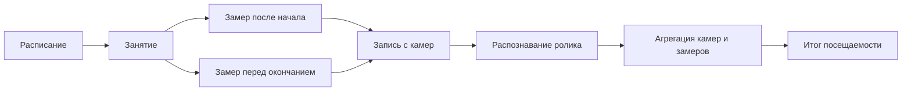

# Система контроля посещаемости учебных занятий

Веб-система для автоматизированного контроля посещаемости по расписанию и
видеоматериалам. На текущем этапе основной сценарий — обработка загруженных
видео и изображений без подключения камер; камерный контур сохранён для
следующего этапа. Система подсчитывает людей, сохраняет результат и показывает
аналитику в браузере.

| Среда | Адрес |
| --- | --- |
| Публичная витрина | [plaksych.github.io/edu-attendance-tracker](https://plaksych.github.io/edu-attendance-tracker/) |
| Swagger UI после локального запуска | [localhost:8000/docs](http://localhost:8000/docs) |
| ReDoc после локального запуска | [localhost:8000/redoc](http://localhost:8000/redoc) |

## Документация

| Раздел | Что внутри |
| --- | --- |
| [Архитектура](docs/architecture.md) | компоненты, связи между сервисами, полный поток одного занятия и состояния очередей |
| [Распознавание](docs/recognition.md) | загрузка видео и изображений, метрики результата, настройки качества и ограничения |
| [Модель данных](docs/data-model.md) | ER-диаграмма PostgreSQL, сущности, связи и ограничения целостности |
| [Эксплуатация](docs/operations.md) | запуск Docker Compose, настройки, масштабирование, диагностика и публикация |
| [API](docs/api.md) | группы endpoint-ов, сценарии работы frontend и ссылка на интерактивную спецификацию |

## Ключевой сценарий



Система использует PostgreSQL одновременно как предметное хранилище и очередь
работ. Исходные ролики и размеченные кадры находятся в MinIO. Запись и
распознавание выполняются независимыми воркерами, поэтому их можно
масштабировать отдельно.

## Возможности

- импорт расписания из `.xlsx`;
- загрузка видео и изображений для распознавания без камер;
- ведение групп, преподавателей, дисциплин, аудиторий и камер;
- один или два замера на занятие с автоматическим планированием;
- запись RTSP-потоков через FFmpeg;
- подсчёт людей по роликам с помощью YOLO;
- несколько режимов объединения результатов камер;
- дашборд, расписание, занятия, медиа и статистика;
- Swagger и ReDoc для backend API;
- статическая демонстрационная версия для GitHub Pages.

## Быстрый запуск

Нужны Docker и Docker Compose. Свободные порты: `3000`, `8000`, `9000`,
`9001`, `5432`.

```bash
cp .env.example .env
docker compose up -d --build
docker compose ps
```

Миграции применяются контейнером `migrate` до запуска backend. После старта
откройте frontend на `http://localhost:3000`, а интерактивную документацию API
на `http://localhost:8000/docs`.

Для загрузки расписания используйте страницу «Расписание» или endpoint:

```bash
curl -F "file=@timetable.xlsx" http://localhost:8000/api/v1/schedule/import
```

## Состав репозитория

| Каталог | Назначение |
| --- | --- |
| `frontend/` | React-приложение, стили, маршруты и статический режим демонстрации |
| `backend/` | FastAPI, миграции Alembic, расписание, агрегация и REST API |
| `capture/` | Воркер записи RTSP-потоков и загрузки роликов в MinIO |
| `recognition/` | Воркер обработки роликов и сохранения результатов распознавания |
| `scripts/` | Подготовка демонстрационных данных из локального расписания |
| `docs/` | Техническая документация проекта |

## Локальная разработка

```bash
# frontend
cd frontend
npm install
npm run dev
```

```bash
# backend
cd backend
python -m venv .venv
source .venv/bin/activate
pip install -r requirements.txt
alembic upgrade head
uvicorn app.main:app --reload
```

Команды проверки frontend:

```bash
cd frontend
npm run build
npm audit --audit-level=high
```

Подробные параметры окружения, запуск воркеров и работа с GitHub Pages описаны
в [инструкции по эксплуатации](docs/operations.md).
