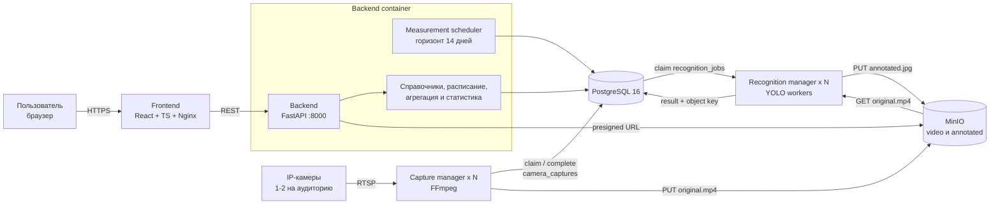
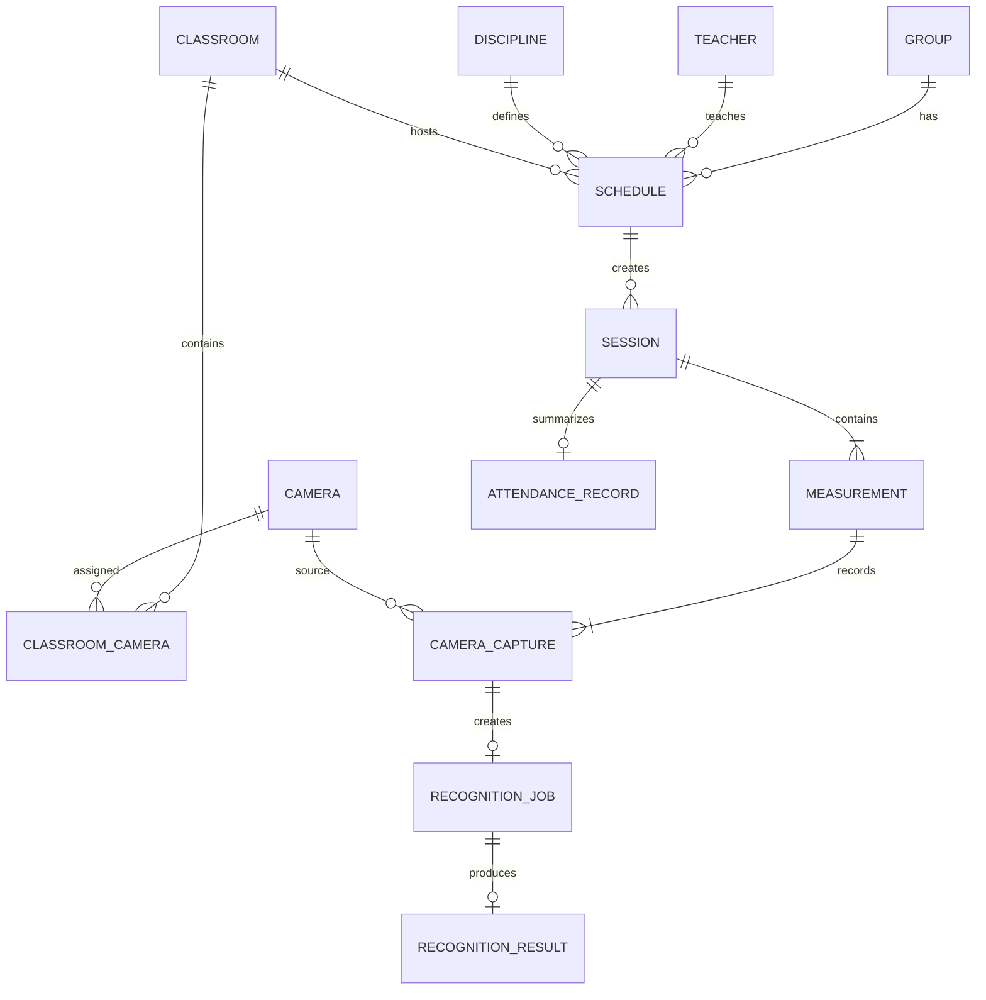

# Система контроля посещаемости учебных занятий

Проект автоматизирует контроль посещаемости по расписанию занятий и потокам с
IP-камер. Система создаёт два замера на каждое занятие, записывает короткие
видеофрагменты, распознаёт людей на кадрах, сохраняет исходное видео и
размеченный кадр, а затем показывает итоговую посещаемость в веб-интерфейсе.

## Возможности

- импорт расписания из `.xlsx`;
- справочники групп, преподавателей, дисциплин и аудиторий;
- регистрация IP-камер и привязка одной или двух камер к аудитории;
- автоматическое создание занятий на горизонт 14 дней;
- два замера на занятие: после начала и перед окончанием;
- параллельная запись видео с камер через FFmpeg;
- хранение видео и размеченных кадров в MinIO;
- очередь записи и очередь распознавания в PostgreSQL;
- горизонтальное масштабирование capture- и recognition-воркеров;
- локальное распознавание людей моделью YOLO;
- агрегация результатов по кадрам, камерам и двум замерам;
- дашборд посещаемости по группам, преподавателям и дисциплинам;
- Swagger-документация backend API.

## Архитектура



Основная идея: PostgreSQL хранит предметные данные и выполняет роль надёжной
очереди, MinIO хранит тяжёлые медиа, а воркеры записи и распознавания можно
масштабировать независимо.

## Компоненты

| Компонент | Где находится | Назначение |
| --- | --- | --- |
| Frontend | `frontend/` | React-приложение: дашборд, расписание, занятия, камеры, справочники |
| Backend | `backend/` | FastAPI, REST API, Swagger, импорт расписания, статистика, presigned URL |
| Scheduler | `backend/app/services/scheduler.py` | Создаёт занятия, замеры и задания записи, возвращает зависшие jobs |
| Capture manager | `capture/` | Забирает `camera_captures`, пишет `.mp4` через FFmpeg, загружает в MinIO |
| Recognition worker | `recognition/` | Забирает `recognition_jobs`, обрабатывает видео YOLO, сохраняет результат |
| PostgreSQL | `docker-compose.yml` | Справочники, расписание, sessions, measurements, queues, результаты |
| MinIO | `docker-compose.yml` | Исходные ролики и размеченные кадры |

## Поток одного занятия

1. Backend создаёт `sessions` по расписанию.
2. Scheduler создаёт два `measurements`:
   - `after_start = starts_at + 15 минут`;
   - `before_end = ends_at - 15 минут`.
3. Для каждой активной камеры аудитории создаются `camera_captures`.
4. Capture manager атомарно забирает задания через PostgreSQL, дожидается
   `planned_at`, записывает 20 секунд видео и кладёт его в MinIO.
5. После успешной записи создаётся `recognition_job`.
6. Recognition worker забирает job, скачивает ролик из MinIO, сэмплирует кадры,
   считает людей и сохраняет `recognition_result`.
7. Backend объединяет результаты камер в итог замера.
8. После закрытия двух замеров backend формирует `attendance_record`.

## Модель данных



Ключевые сущности:

- `groups`, `teachers`, `disciplines`, `classrooms` - справочники;
- `cameras` - физические камеры с `rtsp_url` и `capture_group`;
- `classroom_cameras` - привязка камеры к аудитории, роль и приоритет;
- `schedule` - недельная сетка занятий;
- `sessions` - конкретные занятия на дату;
- `measurements` - два временных среза занятия;
- `camera_captures` - очередь и результат записи видео;
- `recognition_jobs` - очередь распознавания;
- `recognition_results` - агрегаты по кадрам и ключ размеченного изображения;
- `attendance_records` - итог посещаемости занятия.

## Камеры и агрегация

В аудитории штатно используется одна или две камеры. Режим задаётся в поле
`classrooms.aggregation_mode`.

| Режим | Когда использовать | Как считается итог замера |
| --- | --- | --- |
| `single` | одна камера | берётся камера с наивысшим приоритетом |
| `maximum` | зоны камер пересекаются | берётся максимум по камерам |
| `sum` | зоны камер не пересекаются | результаты суммируются |
| `primary_backup` | основная и резервная камера | основная камера, при низкой уверенности резервная |

Складывать пересекающиеся камеры нельзя: один человек может попасть в оба кадра.

## Очереди и отказоустойчивость

PostgreSQL используется как надёжная очередь:

- jobs забираются через `FOR UPDATE SKIP LOCKED`;
- `worker_id` показывает владельца задания;
- `lease_until` ограничивает время владения заданием;
- `attempts` ограничивает число повторов;
- `retry_wait` даёт паузу перед повтором;
- `heartbeat_at` продлевает долгую обработку recognition job.

Если worker упал, backend scheduler возвращает задание в очередь после истечения
lease. Если capture worker получил сигнал остановки до начала записи, он сразу
возвращает ещё не начатые задания в `pending`.

## Хранение медиа

Object keys в MinIO стабильны, поэтому повторная попытка перезаписывает тот же
объект:

```text
original/sessions/{session_id}/measurements/{measurement_id}/cameras/{camera_id}.mp4
annotated/sessions/{session_id}/measurements/{measurement_id}/cameras/{camera_id}.jpg
```

Backend не отдаёт бакет напрямую. Frontend получает временные presigned URL:

- исходное видео хранится 30 дней;
- размеченный кадр хранится 90 дней;
- числовые результаты остаются в PostgreSQL.

## API

После запуска backend документация доступна по адресу:

```text
http://localhost:8000/docs
```

Основные группы endpoints:

- `GET /health` - проверка backend;
- `/api/v1/groups`, `/teachers`, `/disciplines`, `/classrooms` - справочники;
- `/api/v1/cameras` - камеры;
- `/api/v1/classrooms/{id}/cameras` - привязка камер к аудитории;
- `/api/v1/schedule` и `/schedule/import` - расписание;
- `/api/v1/sessions` - занятия и замеры;
- `/api/v1/captures/{id}/media` - временные ссылки на видео и кадр;
- `/api/v1/stats/*` - дашборд и аналитика.

## Быстрый запуск

Требования:

- Docker и Docker Compose;
- свободные порты `3000`, `8000`, `9000`, `9001`, `5432`.

```bash
cp .env.example .env
docker compose up -d --build
docker compose exec backend alembic upgrade head
```

Адреса сервисов:

| Сервис | Адрес |
| --- | --- |
| Frontend | `http://localhost:3000` |
| Backend Swagger | `http://localhost:8000/docs` |
| Backend health | `http://localhost:8000/health` |
| MinIO console | `http://localhost:9001` |

Загрузка расписания через API:

```bash
curl -F "file=@timetable.xlsx" http://localhost:8000/api/v1/schedule/import
```

Масштабирование воркеров:

```bash
docker compose up -d --scale recognition-worker=3
docker compose up -d --scale capture-manager=2
```

## GitHub Pages

Frontend можно собрать как статическую витрину для GitHub Pages. В этом режиме
backend не нужен: приложение читает `frontend/public/demo-data.json`, который
сгенерирован из локального файла `ikn-bak.xlsx`. Сам `.xlsx` в репозиторий не
добавляется.

Локальная проверка статического режима:

```bash
PYTHONPATH=backend .venv/bin/python scripts/generate_demo_data.py ikn-bak.xlsx frontend/public/demo-data.json
cd frontend
VITE_STATIC_DATA=true npm run build -- --base=/
```

Workflow `.github/workflows/pages.yml` собирает frontend при push в `develop` и
публикует `frontend/dist` через GitHub Pages. В репозитории нужно один раз
включить Pages source `GitHub Actions` в настройках GitHub. Пока Pages не
включён, workflow соберёт frontend и пропустит deploy без ошибки. Если хочется,
чтобы workflow сам включал Pages, добавьте repository secret `PAGES_ADMIN_TOKEN`
с правами управления Pages/administration для этого репозитория.

## Настройки

Основные переменные находятся в `.env.example`.

| Переменная | Значение |
| --- | --- |
| `DB_HOST`, `DB_PORT`, `DB_NAME`, `DB_USER`, `DB_PASSWORD` | подключение backend к PostgreSQL |
| `DATABASE_URL` | строка подключения для capture и recognition |
| `MINIO_ENDPOINT` | внутренний адрес MinIO для сервисов |
| `MINIO_PUBLIC_ENDPOINT` | адрес MinIO, доступный браузеру для presigned URL |
| `MINIO_BUCKET` | бакет для видео и кадров |
| `TIMEZONE` | часовой пояс расписания |
| `SEMESTER_START` | понедельник первой учебной недели |
| `CAPTURE_GROUP` | группа камер, которую обслуживает capture manager |

Параметры scheduler и очередей задаются в `backend/app/core/config.py`,
`capture/app/config.py` и `recognition/app/config.py`.

## Разработка

Backend:

```bash
cd backend
python -m venv .venv
source .venv/bin/activate
pip install -r requirements.txt
alembic upgrade head
uvicorn app.main:app --reload
```

Frontend:

```bash
cd frontend
npm install
npm run dev
```

Capture manager:

```bash
cd capture
pip install -r requirements.txt
python -m app.main
```

Recognition worker:

```bash
cd recognition
pip install -r requirements.txt
python -m app.main
```

## Проверки перед push

```bash
python3 -m compileall backend/app capture/app recognition/app
docker compose config -q
cd frontend && npm run build
```

Для полной проверки с базой:

```bash
docker compose up -d --build
docker compose exec backend alembic upgrade head
curl http://localhost:8000/health
```

## Структура репозитория

```text
backend/
  app/api/v1/          REST endpoints
  app/models/          SQLAlchemy-модели
  app/schemas/         Pydantic-схемы и Swagger-описания
  app/services/        scheduler, импорт, агрегация, статистика, media links
  alembic/             миграции БД

capture/
  app/db.py            claim/complete camera_captures
  app/recorder.py      запись ролика через FFmpeg
  app/storage.py       загрузка original.mp4 в MinIO

recognition/
  app/db.py            claim/heartbeat/complete recognition_jobs
  app/processor.py     обработка видео и расчёт агрегатов
  app/detector.py      обёртка над YOLO
  app/storage.py       MinIO download/upload

frontend/
  src/pages/           страницы приложения
  src/api/             клиент backend API
  src/components/      общие компоненты интерфейса
```

## Команда

- Балалыкин М.Г. - teamlead, backend
- Матвейчев И.В. - recognition, backend
- Плешкова Д.С. - database, backend
- Попова Ю.А. - frontend

Проект выполнен в рамках производственной практики.
