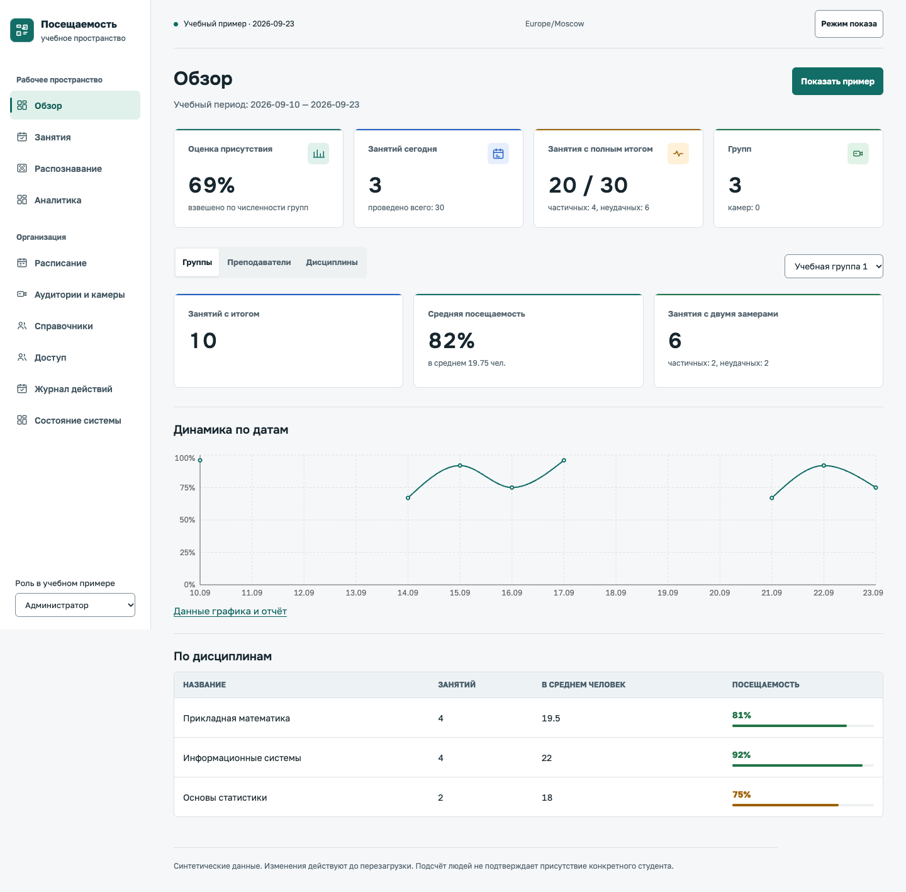

# edu-attendance-tracker

Система оценивает количество людей на изображениях и видео, связывает результаты
с замерами занятий и показывает агрегаты посещаемости. Она **не распознаёт
личности**, не ведёт индивидуальные нарушения и не доказывает присутствие студента.

Стек: React + TypeScript + Vite, FastAPI + SQLAlchemy + Alembic, PostgreSQL,
S3/MinIO, отдельные scheduler, maintenance и recognition worker.
RTSP capture остаётся опциональным профилем `camera`.

Подготовлен кандидат для review. Наличие ветки production не означает
готовый production-релиз: серверные образы пока блокируются CVE/license проверками.
Полный S3 restore, путь API→S3→worker→отчёт, происхождение
весов и внешний допуск должны быть подтверждены отдельно. Fixtures и mock-тесты
не являются доказательством модели или серверных полномочий.

## Интерфейс

Реальный screenshot локального frontend с синтетическими данными, не фотография
учебного занятия и не результат inference. Показатели полноты на обзоре считают
занятия, не отдельные замеры:



[Мобильный screenshot](docs/diagrams/rendered/UI-overview-mobile.png) ·
[Условия съёмки](docs/diagrams/rendered/ui-manifest.json)

Admin «Режим показа»: обзор → распознавание → первое занятие → аналитика его
группы. Это те же экраны и данные, без подмены backend permissions.

## Три Режима

| Режим | Что работает | Что не следует из показа |
| --- | --- | --- |
| Статическое демо | Синтетические занятия, роли интерфейса, графики/CSV; demo_fixture | Нет backend auth и inference |
| Browser inference | Свой разрешённый файл обрабатывает ONNX/WASM Worker на устройстве | Нет отправки медиа, серверной job и доказанной точности |
| Полный стенд | Cookie auth, scope, upload, очередь, история, серверный worker | Нужны подготовленные БД/S3/веса/TLS; запуск не подтверждается статикой |

Отмена/ошибка модели не подменяется готовым числом. Полный стенд и демо
разделяются project/database/bucket/credentials, а не только цветом интерфейса.

## Быстрый Старт Без Контейнеров

Нужны Node.js 24 (в CI закреплён 24.21.0) и npm. Из корня repo:

```bash
cd frontend
npm ci
npm run dev:demo -- --host 127.0.0.1 --port 4173 --strictPort
```

Открыть `http://127.0.0.1:4173/#/`. Ожидается синтетический обзор с меткой
«Учебный пример». При занятом порте выбрать другой; Ctrl+C останавливает сервер.
Reload сбрасывает demo-изменения. Публичный deployment этим документом не заявляется.

Browser inference запускается из «Распознавание» → «Проверить файл». Использовать
только разрешённые материалы. Нужны secure localhost/HTTPS, поддержка Worker,
OffscreenCanvas/Web Crypto и загрузка assets модели. Неподдерживаемый браузер
или неверный hash дают ошибку, не fixture.

## Серверный Контур

Не использовать прежний `docker compose up --build` с fallback-паролями.
Текущая конфигурация требует явных immutable images, scoped DSN/IAM, TLS,
MODEL_FILE/SHA256, SEMESTER_START и SEMESTER_END.
Порядок подготовки, запуска и восстановления: [эксплуатация](docs/operations.md).

Из корня repo можно проверить интерфейс существующих ops-команд без запуска:

```bash
python3 scripts/ops/manage.py --help
python3 scripts/ops/data.py --help
```

API login использует HttpOnly cookie и CSRF; upload/retry требуют Idempotency-Key.
Импорт XLSX двухфазный: preview, затем confirm. API/очередь не выдают успех модели
до реального результата. [Сценарии запросов](docs/api.md).
Первый admin создаётся offline через `python -m app.admin USERNAME` из backend/
в подготовленном окружении; пароль запрашивается через TTY.

## Документация

| Документ | Содержание |
| --- | --- |
| [Архитектура](docs/architecture.md) | Процессы, данные, очереди и границы гарантий |
| [Модель данных](docs/data-model.md) | ERD, snapshots, история, календарь, миграции и удаление |
| [Распознавание](docs/recognition.md) | Реальные pipeline, manifests, параметры, метрики и ограничения |
| [API](docs/api.md) | Auth, scope, errors, pagination, idempotency и импорт |
| [Безопасность](docs/security.md) | Секреты, upload/RTSP boundaries, retention и оставшиеся проверки |
| [Демо](docs/demo.md) | Режимы, фиксированная дата, сброс и сценарий показа |
| [Тестирование](docs/testing.md) | Команды и различие unit/mock/PG/UI/real inference |
| [Интерфейс](docs/design-system.md) | Палитра, шрифты, компоненты, состояния и screenshots |
| [Эксплуатация](docs/operations.md) | Конфигурация, запуск, выпуск и восстановление |
| [Допуск кандидата](docs/production-readiness.md) | Финальные evidence и незакрытые критерии |
| [Схемы D01–D14](docs/diagrams/README.md) | Редактируемые Mermaid, SVG/PNG, воспроизводимый renderer |
| [ADR](docs/adr/) | Очередь, отдельные процессы, sessions, demo isolation и история upload |

Документы audit/readiness/progress ведутся отдельно владельцем интеграции.
Старые отчёты и приватные report-assets не используются как доказательство
текущего состояния. Модель и материалы не публикуются только на основании hash:
происхождение и разрешения должен подтвердить владелец.

## Проверки

Из frontend/: `npm run typecheck`, `npm run lint`, `npm test`,
`npm run build`, `npm run build:demo`, `npm run test:e2e`.
Prerequisites и тестовые DSN описаны в [testing](docs/testing.md).

После установки зависимостей схем:
`npm --prefix docs/diagrams run render`,
`npm --prefix docs/diagrams run check`,
`npm --prefix docs/diagrams run links`.
Тестовые результаты привязываются к конкретной ревизии, а не к этому README.
