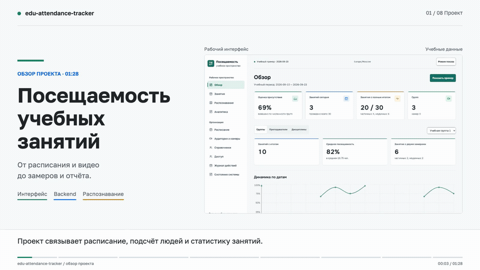
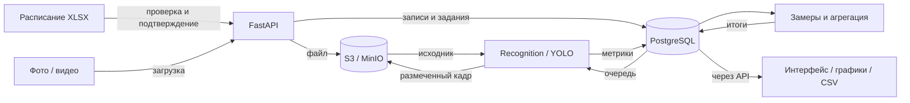

# edu-attendance-tracker

Расписание, подсчёт людей на фото и видео, замеры занятий и отчёты по группам.
Проект **не определяет личности** и не подтверждает присутствие конкретного студента.

**React / TypeScript** · **FastAPI** · **PostgreSQL** · **S3 / MinIO** · **YOLO**

[Быстрый старт](#быстрый-старт-без-контейнеров) ·
[Архитектура](docs/architecture.md) · [API](docs/api.md) ·
[Распознавание](docs/recognition.md) · [Эксплуатация](docs/operations.md)

## Проект За Полторы Минуты

[](https://github.com/plaksych/edu-attendance-tracker/raw/refs/heads/production/docs/overview/project-overview-ru.mp4)

**[Скачать полный ролик · MP4 · 1:28](https://github.com/plaksych/edu-attendance-tracker/raw/refs/heads/production/docs/overview/project-overview-ru.mp4)** ·
[Главы и текст обзора](docs/overview/README.md)

Русские титры, без звука. Экраны приложения сняты на учебных данных;
серверный поток показан схемой. В ролике нет персональных данных студентов
и заявлений о точности модели по демонстрационным числам.

> **Статус: кандидат для проверки.** Сквозной сценарий с настоящей моделью и
> восстановление БД/файлов проверены в CI. Выпуск серверных образов пока
> блокируют проверки уязвимостей и лицензий.
> [Результаты проверок и условия выпуска](docs/production-readiness.md).

## Откуда Данные И Куда Они Идут


```mermaid
flowchart LR
    X[Расписание XLSX] -->|проверка и подтверждение| API[FastAPI]
    F[Фото / видео] -->|загрузка| API
    API -->|файл| S3[(S3 / MinIO)]
    API -->|записи и задания| DB[(PostgreSQL)]
    DB -->|очередь| R[Recognition / YOLO]
    S3 -->|исходник| R
    R -->|метрики| DB
    R -->|размеченный кадр| S3
    DB --> A[Замеры и агрегация]
    A -->|итоги| DB
    DB -->|через API| UI[Интерфейс / графики / CSV]
```

1. **Расписание.** После проверки XLSX записи попадают в БД. Планировщик создаёт
   занятия и два замера: после начала и перед окончанием.
2. **Материалы.** API проверяет фото или видео, сохраняет исходник в S3 и создаёт
   задание в PostgreSQL. Ответ `202` означает принятие в работу, а не готовый результат.
3. **Распознавание.** Отдельный worker получает задание и файл. YOLO ищет людей
   на выбранных кадрах; итог видео считается по медиане. Метрики сохраняются
   в БД, размеченный JPEG — в S3.
4. **Отчёты.** Результат, привязанный к замеру, участвует в итогах занятия.
   Интерфейс получает данные через API; изображения — по временным ссылкам.

Камерный путь подключается отдельно: **RTSP → FFmpeg → S3 → очередь распознавания**.
Фото и видео можно загружать без камер. [Подробные связи и гарантии](docs/architecture.md).

## Где Что Лежит

| Каталог | За что отвечает |
| --- | --- |
| [`frontend/src/`](frontend/src/) | Страницы, формы, графики, API-клиент и локальное распознавание |
| [`backend/app/`](backend/app/) | API, доступ, расписание, планировщик и агрегация замеров |
| [`recognition/app/`](recognition/app/) | Очередь заданий, запуск YOLO, обработка кадров и метрики |
| [`capture/app/`](capture/app/) | Захват RTSP через FFmpeg и загрузка видео в хранилище |
| [`scripts/ops/`](scripts/ops/) | Запуск, проверки окружения, резервные копии и восстановление |
| [`docs/`](docs/) | Архитектура, API, параметры, схемы и порядок эксплуатации |

**Интерфейс:** [десктоп](docs/diagrams/rendered/UI-overview-desktop.png) ·
[мобильный экран](docs/diagrams/rendered/UI-overview-mobile.png).
В режиме показа можно пройти обзор, распознавание, занятие и аналитику группы.

## Три Режима

| Режим | Что работает | Что не следует из показа |
| --- | --- | --- |
| Статическое демо | Учебное расписание, роли интерфейса, графики и CSV | Нет серверной авторизации; числа заданы в примере |
| Локальное распознавание | Свой файл обрабатывается через ONNX/WASM на устройстве | Файл не отправляется на сервер; качество требует проверки |
| Полный стенд | Вход, доступ по ролям, загрузка, очередь и история результатов | Нужны БД, S3, веса модели и HTTPS |

При ошибке модели интерфейс не подставляет готовое число. Для демо и рабочего
стенда используются отдельные окружения, базы, хранилища и учётные данные.

## Быстрый Старт Без Контейнеров

Нужны Node.js 24 (в CI закреплён 24.21.0) и npm. Из корня репозитория:

```bash
cd frontend
npm ci
npm run dev:demo -- --host 127.0.0.1 --port 4173 --strictPort
```

Открыть `http://127.0.0.1:4173/#/`. Ожидается синтетический обзор с меткой
«Учебный пример». При занятом порте выбрать другой; Ctrl+C останавливает сервер.
Перезагрузка страницы сбрасывает изменения учебного примера.

Свой файл можно проверить в «Распознавание» → «Проверить файл».
Нужен современный браузер с Worker, OffscreenCanvas и Web Crypto; страница должна
быть открыта через localhost или HTTPS. При первом запуске загружаются файлы модели.
Используйте только материалы, на обработку которых у вас есть разрешение.

## Серверный Контур

Запуск требует закреплённых образов, отдельных прав БД и хранилища, HTTPS,
проверенных весов модели и границ семестра. Паролей «по умолчанию» нет.
Порядок подготовки, запуска и восстановления: [эксплуатация](docs/operations.md).

Справка по командам, без запуска сервисов:

```bash
python3 scripts/ops/manage.py --help
python3 scripts/ops/data.py --help
```

Вход использует HttpOnly cookie и защиту CSRF. Загрузка файла и повторная обработка
требуют `Idempotency-Key`, чтобы повтор запроса не создавал дубликаты.
[Примеры запросов](docs/api.md).
Первый администратор создаётся командой `python -m app.admin USERNAME` из
`backend/` в подготовленном окружении; пароль вводится в терминале.

## Документация

| Документ | Содержание |
| --- | --- |
| [Архитектура](docs/architecture.md) | Процессы, данные, очереди и границы гарантий |
| [Модель данных](docs/data-model.md) | Таблицы, связи, история, календарь и миграции |
| [Распознавание](docs/recognition.md) | Модель, обработка кадров, настройки, метрики и ограничения |
| [API](docs/api.md) | Авторизация, права, запросы, ошибки и импорт |
| [Безопасность](docs/security.md) | Доступ, проверка файлов, RTSP и сроки хранения |
| [Демо](docs/demo.md) | Режимы, фиксированная дата, сброс и сценарий показа |
| [Тестирование](docs/testing.md) | Команды, тестовые окружения и проверяемые сценарии |
| [Интерфейс](docs/design-system.md) | Палитра, шрифты, компоненты и скриншоты |
| [Эксплуатация](docs/operations.md) | Конфигурация, запуск, выпуск и восстановление |
| [Готовность к выпуску](docs/production-readiness.md) | Результаты проверок и оставшиеся ограничения |
| [Схемы D01–D14](docs/diagrams/README.md) | Исходники Mermaid, готовые SVG/PNG и команды сборки |
| [Архитектурные решения](docs/adr/) | Почему выбраны очередь в БД, отдельные процессы и версионирование результатов |

Условия использования моделей и материалов перечислены в
[THIRD_PARTY_NOTICES](THIRD_PARTY_NOTICES.md).

## Проверки

Из `frontend/`: `npm run typecheck`, `npm run lint`, `npm test`,
`npm run build`, `npm run build:demo`, `npm run test:e2e`.
Зависимости и параметры тестовых БД описаны в [инструкции по тестированию](docs/testing.md).

После установки зависимостей схем:
`npm --prefix docs/diagrams run render`,
`npm --prefix docs/diagrams run check`,
`npm --prefix docs/diagrams run links`.
Каждый результат CI относится к конкретному коммиту.
