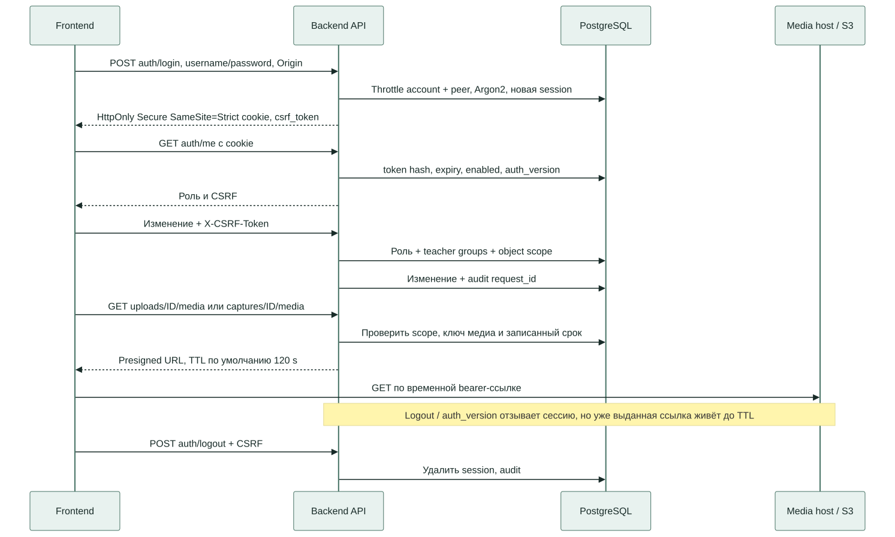

# API

База API: `/api/v1`. После запуска доступны `/openapi.json`, `/docs`, `/redoc`.
OpenAPI генерируется из текущего приложения; не копируйте старый JSON между
ревизиями. Часть ручных заголовков и dict-ответов не полностью описана типами
OpenAPI: ориентируйтесь также на маршруты и этот контракт.

[Доступ](security.md) · [Распознавание](recognition.md) · [Данные](data-model.md)

## Вход И Права

`POST /auth/login` принимает JSON username/password и возвращает пользователя
с csrf_token; устанавливает HttpOnly Secure SameSite=Strict cookie
`attendance_session`. TTL по умолчанию 28800 секунд. `GET /auth/me` возвращает
текущего пользователя и CSRF. `POST /auth/logout` с CSRF удаляет сессию, ответ 204.

Все изменяющие аутентифицированные запросы требуют `X-CSRF-Token`.
Login не требует сессии; проверяет Origin, если он передан. Bearer/JWT API
не реализован. Cookie не хранится в localStorage.

| Область | Роли API |
| --- | --- |
| Auth/me/logout | Любой вошедший пользователь |
| Справочники и schedule GET | Все роли; teacher ограничен grants |
| Изменения справочников, schedule, импорт | admin, operator |
| Cameras и назначение камер | admin |
| Sessions, capture media, recognition GET | admin, operator, teacher с object scope |
| Отмена занятия | admin, operator |
| Upload / retry | admin, operator, teacher с проверкой scope |
| Ручная correction | admin, operator |
| Stats | Все роли; teacher только разрешённые группы |
| Admin users / audit | admin |

Frontend может иметь более узкую видимость меню; это не изменяет API-права.
Teacher видит собственные uploads или uploads разрешённой session; чужой
объект возвращается как 404. Analyst не получает media/recognition/session detail.

## Маршруты

Все пути таблицы относительно /api/v1. Фактические схемы полей см. OpenAPI.

| Маршрут | Поведение |
| --- | --- |
| GET/POST /groups; PATCH /groups/{id} | Группы |
| GET/POST /teachers, /disciplines | Преподаватели, дисциплины |
| GET/POST /classrooms; PATCH /classrooms/{id} | Аудитории и режим агрегации |
| GET/POST /cameras; PATCH/DELETE /cameras/{id} | Камеры; rtsp_url в ответе пустой |
| PUT /classrooms/{id}/cameras | Назначить камеры; unique зоны для sum, одна primary для primary_backup |
| GET/POST /schedule; DELETE /schedule/{id} | Расписание; история защищена от удаления |
| GET /schedule/template, /schedule/week-type?date=YYYY-MM-DD | XLSX template; тип недели |
| GET /schedule/calendar; PUT /schedule/calendar/{day} | Calendar exceptions: выходной/перенос |
| POST /schedule/import/preview | Проверить XLSX, вернуть preview без применения расписания |
| POST /schedule/import/{preview_id}/confirm | Применить собственный preview |
| POST /schedule/import | Legacy endpoint: 409; использовать preview/confirm |
| GET /sessions/today; GET /sessions?date=YYYY-MM-DD | Занятия; date обязателен для второго маршрута |
| GET /sessions/{id}; POST /sessions/{id}/cancel | Деталь и отмена |
| GET /captures/{id}/media | Временные video/annotated ссылки |
| GET /recognition/capabilities | Форматы и настроенные API limits |
| POST/GET /recognition/uploads | Multipart upload / список |
| GET /recognition/uploads/{id} | Состояние последней job |
| GET /recognition/uploads/{id}/media | source_url, annotated_url и причины отсутствия |
| POST /recognition/uploads/{id}/retry | Новая job, 202; прошлый result сохраняется |
| GET /recognition/uploads/{id}/history | Все jobs и corrections |
| POST /recognition/uploads/{id}/corrections | people_count + reason; 201; raw result неизменен |
| GET /recognition/evaluation/summary | Метрики результатов с ручным эталоном |
| GET /stats/summary | Счётчики и взвешенная посещаемость |
| GET /stats/groups/{id}, /stats/teachers/{id}, /stats/disciplines/{id} | Агрегаты сущности |
| GET /stats/groups/{id}/timeline?date_from=...&date_to=... | Динамика группы по датам |
| GET /stats/export.csv?date_from=...&date_to=...&group_id=... | Серверный CSV с scope; даты обязательны, group optional |
| GET/POST /admin/users; PATCH /admin/users/{id} | Пользователи и отзыв доступа |
| GET /admin/audit | Журнал событий |
| GET /admin/system | Реальный статус БД/S3, очередь и последний job heartbeat; только admin |

PATCH admin/users принимает role, enabled, password, group_ids и обязательную
reason (3–500 символов). Изменение увеличивает auth_version и отзывает старые
сессии. Нельзя отключить себя или отозвать собственную роль admin этим endpoint.
Регистрация без администратора не реализована.

Calendar PUT принимает teaching, optional weekday (1–7), week_type
(white/green/every) и reason (3–300). Если на дату уже созданы sessions, ответ 409:
история не переносится молча. Production требует границы SEMESTER_START/SEMESTER_END.
CSV export ограничен 366 днями и 10000 строками; содержит timezone/provenance,
нейтрализует формульные строки и не выдаёт медиа. Пустая выборка даёт header.

## Upload И Идемпотентность

Multipart: file, sample_rate_fps (default 1), confidence_threshold (0.35),
optional label, reference_people_count, session_id, measurement_id.
Сначала проверяются scope и принадлежность measurement к session, потом файл.
Ответ 202 содержит upload с job; завершения ожидают через GET. Для measurement
запрещены второй upload и смешение с capture (409). Только связь measurement_id
позволяет scheduler взять результат в открытый замер; session_id не заменяет её.
Новые uploads ограничены RECOGNITION_PENDING_PER_USER (default 20) активных jobs
владельца: при превышении 429 и Retry-After 30. Это не общая дисковая квота.

Upload и retry обязательно требуют `Idempotency-Key`: 1–120 ASCII-символов.
Пространство ключа: пользователь + маршрут + ключ. Fingerprint загрузки включает
SHA256 файла, filename и параметры. Повтор с другим содержимым даёт 409;
просроченный ключ (24 часа) также даёт 409, нужен новый ключ.
Не генерируйте новый ключ на каждый сетевой повтор одной операции.

Retry разрешён после completed/failed/cancelled, создаёт новую job с прежними
параметрами. Сетевая неопределённость не означает, что надо удалять S3-объект.
Проверяйте GET/history перед новым намеренным запуском.

Evaluation summary берёт только последнюю job материала, если она completed
и имеет эталонную ошибку. Pending/failed retry исключает прошлый результат
из summary; история сохраняется. Отмена session отменяет связанные активные
camera/upload jobs и очищает claims. Upload и retry для cancelled session дают 409.

Замер в session response содержит source_reference_status и source_results:
recognition_result_id, recognition_job_id, camera_capture_id, upload_id,
people_count, used_for_count. Capture detail содержит role_snapshot,
priority_snapshot, zone_code_snapshot, snapshot_origin. NULL/legacy_unknown
не означают восстановленное происхождение старого результата.

Пример из корня repo для уже подготовленного HTTPS-стенда. Нужны curl, jq,
разрешённый тестовый файл и приватный JSON credentials с username/password.
Пути ниже placeholders; не коммитьте cookie jar, JSON входа или signed URL.

```bash
API='https://attendance.example.invalid:8443/api/v1'
COOKIE_JAR="$(mktemp)"
LOGIN="$(curl --fail-with-body -sS -c "$COOKIE_JAR" \
  -H 'Content-Type: application/json' \
  --data-binary @/secure/login.json "$API/auth/login")"
CSRF="$(printf '%s' "$LOGIN" | jq -er '.csrf_token')"
KEY="$(uuidgen)"
UPLOAD="$(curl --fail-with-body -sS -b "$COOKIE_JAR" \
  -H "X-CSRF-Token: $CSRF" -H "Idempotency-Key: $KEY" \
  -F 'file=@/tmp/approved-test.png' -F 'confidence_threshold=0.35' \
  "$API/recognition/uploads")"
ID="$(printf '%s' "$UPLOAD" | jq -er '.id')"
curl --fail-with-body -sS -b "$COOKIE_JAR" "$API/recognition/uploads/$ID"
curl --fail-with-body -sS -b "$COOKIE_JAR" "$API/recognition/uploads/$ID/history"
curl --fail-with-body -sS -b "$COOKIE_JAR" "$API/recognition/uploads/$ID/media"
curl --fail-with-body -sS -b "$COOKIE_JAR" -H "X-CSRF-Token: $CSRF" \
  -X POST "$API/auth/logout"
rm -f "$COOKIE_JAR"
unset LOGIN CSRF UPLOAD
```

Ожидается 200 login, 202 upload, затем pending/processing/terminal по GET.
Без модели ожидайте failed, не готовый счёт. Ошибки TLS исправляют сертификатом
и trusted host, не отключением проверки TLS. 401 после HTTP login может означать
Secure cookie на незащищённом соединении.

## Импорт

Preview принимает multipart XLSX, срок 30 минут, привязан к владельцу.
Возвращает preview_id, expires_at, created (предварительное число), skipped,
errors, rows. Он не применяет расписание. Confirm проверяет expiry, владельца
и конфликты заново под блокировкой. При ошибках 409, никаких частичных вставок.
Повтор confirmed preview возвращает created=0 и skipped; это не повторный импорт.
Legacy /schedule/import с файлом отвечает 409 даже если файл корректен.

XLSX body ограничен 10 MiB; проверяются ZIP expansion, строки/колонки/ячейки,
запрет формул, макросов, external links, DTD и шифрования. Не импортировать
приватную учебную книгу в демонстрацию.

## Списки И Ошибки

Uploads, admin/users и admin/audit принимают limit (default 50, clamp 1–100)
и offset (не меньше 0). Ответ массив, без total/cursor. Не все остальные списки
пагинированы; не обещать одинаковый контракт pagination для всего API.

Ошибка HTTP обычно имеет detail и error:

```json
{"detail":"Требуется вход в систему","error":{"code":"unauthenticated","message":"Требуется вход в систему","request_id":"UUID"}}
```

| HTTP | Код / действие |
| --- | --- |
| 401 | unauthenticated: войти заново |
| 403 | forbidden: роль, CSRF или Origin |
| 404 | not_found: отсутствует либо скрыт scope |
| 409 | conflict: конфликт ключа, состояния, истории или preview |
| 413 | payload_too_large у body middleware; ошибка содержимого может иметь request_error |
| 422 | validation_error: поля/формат/обязательный idempotency key |
| 429 | rate_limited; Retry-After для login throttle |
| 503 | unavailable: например S3 при сохранении upload |

`X-Request-ID` создаётся сервером; ответы middleware имеют Cache-Control no-store
и nosniff. Validation error не возвращает исходные секретные значения.
У необработанной 500 не гарантирован тот же JSON envelope.

## Медиа И Probes



Media endpoints проверяют object scope, возвращают URL или NULL + reason.
TTL default 120 секунд. Logout отзывает сессию, но уже выданная bearer-ссылка
действует до TTL. Проверка срока в БД не делает stat_object: успешная выдача
URL не доказывает, что объект физически существует.

`/health` проверяет ответ API-процесса; `/health/ready` требует Alembic revision
0010 и существование бакета, при ошибке отвечает 503. Readiness не подтверждает
IAM всех операций, inference, активность worker и end-to-end поток.
`/admin/system` показывает database/storage, recognition_queue, last_job_heartbeat,
timezone/environment, camera_enabled и backup_status=`not_verified`. Это не
сервисный heartbeat scheduler/capture; camera_enabled отражает конфигурацию,
не доступность камер. Здоровый API не означает успешное восстановление backup.
