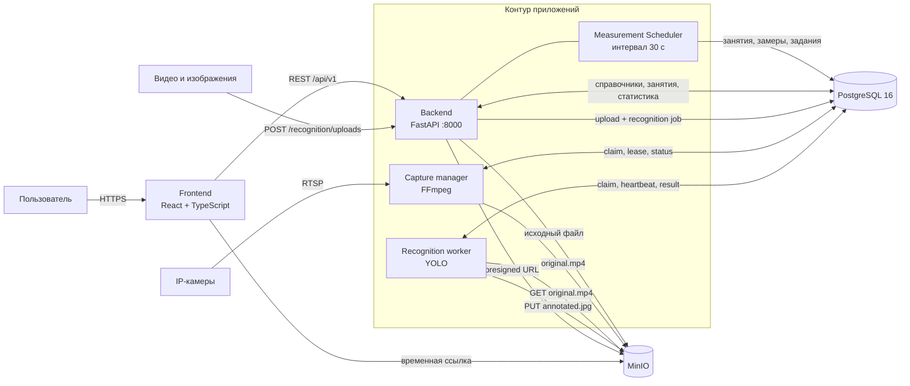
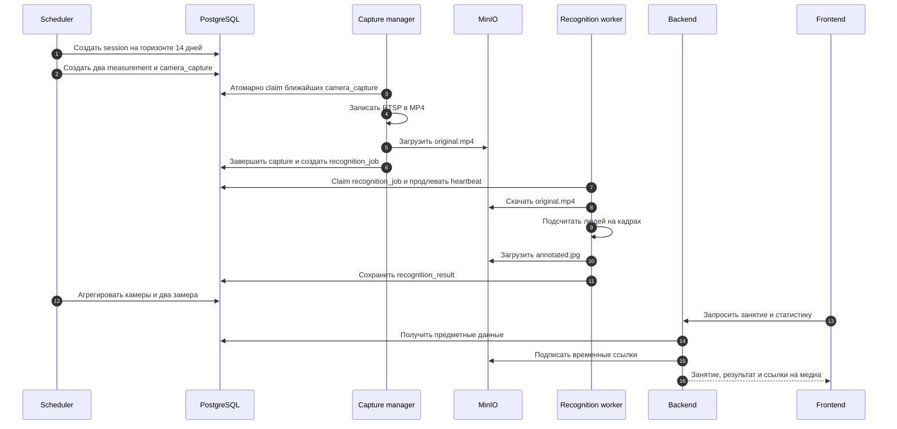
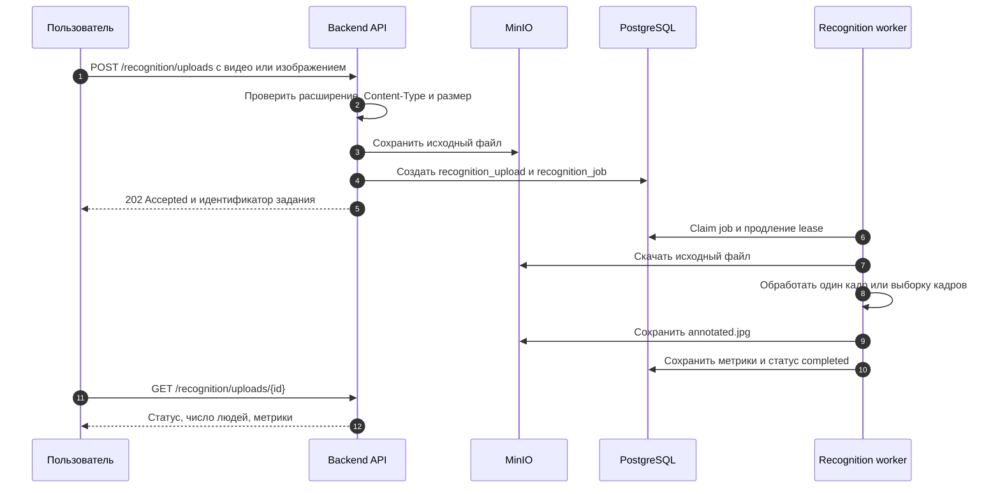
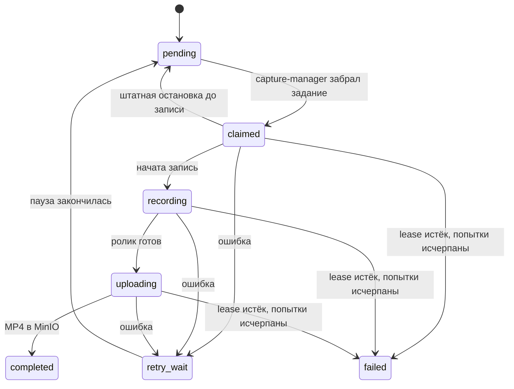
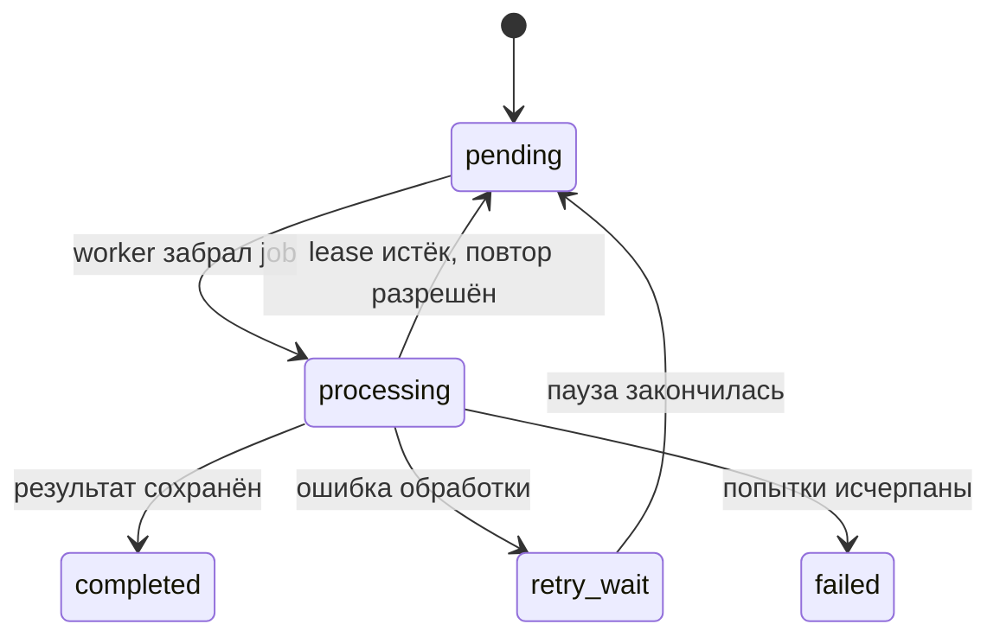

# Архитектура

Система разделена на четыре независимых роли: интерфейс, backend с планировщиком,
запись видеопотока и обработка роликов. PostgreSQL хранит предметные данные и
координирует очереди, MinIO хранит медиафайлы.

[К оглавлению](../README.md) · [Модель данных](data-model.md) · [Эксплуатация](operations.md) · [API](api.md)

## Карта компонентов



### Границы ответственности

| Компонент | Ответственность | Масштабирование |
| --- | --- | --- |
| `frontend` | визуализация, формы и запросы к REST | статическая сборка или один Nginx-контейнер |
| `backend` | API, импорт, scheduler, агрегация, выдача временных ссылок | обычно один экземпляр scheduler; API можно отделить при дальнейшем развитии |
| `capture-manager` | запись RTSP, загрузка исходного ролика | по сетевым зонам камер через `CAPTURE_GROUP` |
| `recognition-worker` | обработка загруженных файлов и роликов камер, загрузка размеченного кадра | независимое горизонтальное масштабирование |
| PostgreSQL | данные вуза, состояния заданий, lease и результаты | резервное копирование обязательно |
| MinIO | исходные ролики и размеченные кадры | жизненный цикл объектов и резервное копирование |

## Поток одного занятия



## Поток загруженного файла



Подробности работы с этим сценарием приведены в разделе
[«Распознавание»](recognition.md).

## Как формируется посещаемость

1. Scheduler создаёт `session` из недельного расписания.
2. Для занятия создаются два `measurement`: через 15 минут после начала и за
   15 минут до конца. Смещение настраивается через `MEASUREMENT_OFFSET_MINUTES`.
3. На каждый активный источник аудитории создаётся `camera_capture`.
4. После успешной записи создаётся один `recognition_job`.
5. Результаты камер объединяются в итог замера согласно `aggregation_mode` аудитории.
6. Два завершённых замера образуют `attendance_record`. Если доступен только
   один замер, результат сохраняется со статусом `partial`.

## Режимы объединения камер

| Режим | Когда применять | Итог замера |
| --- | --- | --- |
| `single` | одна камера | результат камеры с наивысшим приоритетом |
| `maximum` | зоны камер пересекаются | максимум значений по камерам |
| `sum` | зоны не пересекаются | сумма значений по камерам |
| `primary_backup` | основная камера с резервной | основная; резервная при низкой уверенности или отсутствии основной |

Не используйте `sum`, если одна и та же зона попадает в несколько камер: это
приведёт к двойному учёту людей.

## Состояния очередей

### Запись с камеры



### Распознавание



Для захвата заданий используются `FOR UPDATE SKIP LOCKED`, `worker_id` и
`lease_until`. Это исключает одновременную обработку одного задания двумя
воркерами и возвращает работу в очередь после сбоя процесса.

## Хранение медиа

```text
original/sessions/{session_id}/measurements/{measurement_id}/cameras/{camera_id}.mp4
annotated/sessions/{session_id}/measurements/{measurement_id}/cameras/{camera_id}.jpg
original/uploads/{random_key}.{ext}
annotated/uploads/{upload_id}.jpg
```

Backend не раскрывает постоянные ссылки на бакет. Он выдаёт временные
presigned URL. По умолчанию исходный ролик хранится 30 дней, размеченный кадр
90 дней; значения настраиваются переменными окружения и lifecycle-политикой
бакета.
