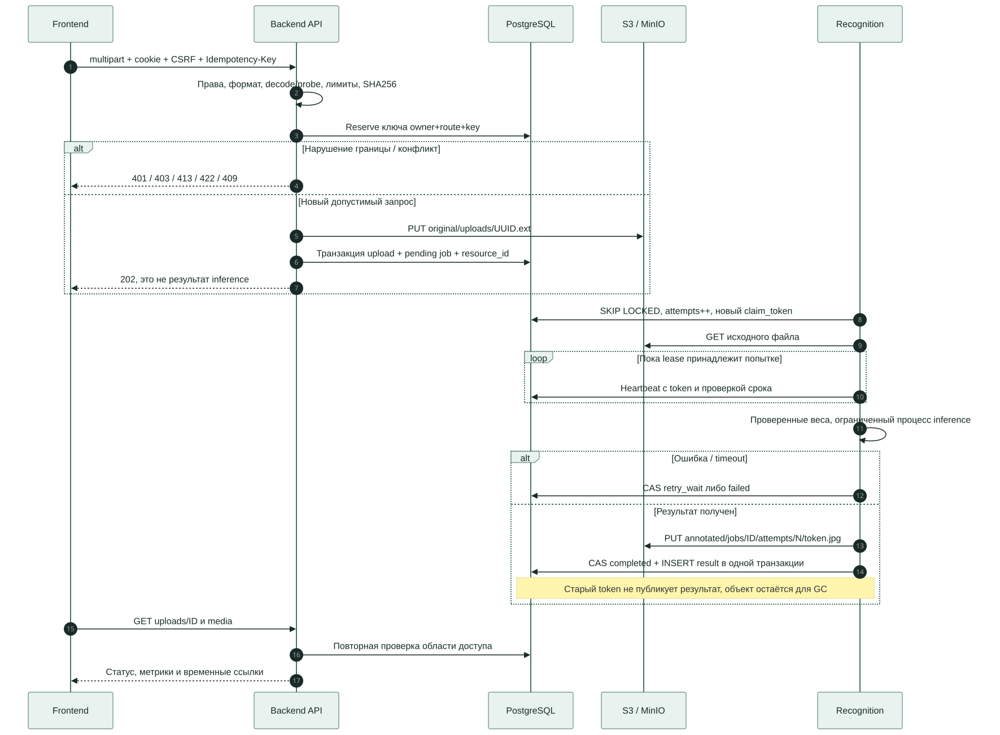
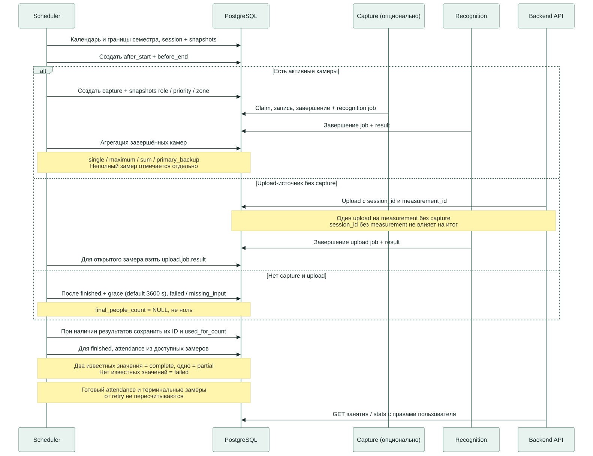

# Архитектура

Один вуз на развёртывание: React + TypeScript + Vite, FastAPI + SQLAlchemy,
PostgreSQL и S3. Основной серверный сценарий начинается с загрузки файла.
Камеры подключаются отдельно профилем `camera`. Подсчёт людей не устанавливает
личности и не доказывает присутствие конкретного студента.

[README](../README.md) · [API](api.md) · [Данные](data-model.md) · [Безопасность](security.md)

## Компоненты



| Компонент | Ответственность и точка входа |
| --- | --- |
| Frontend | React-роуты, формы, cookie/CSRF клиент, статический адаптер; `frontend/src/App.tsx` |
| Backend API | Доступ, валидация, предметные операции, presigned URL; `backend/app/main.py` |
| Scheduler | Горизонт занятий, замеры, camera jobs, агрегация; `python -m app.scheduler` из `backend/` |
| Maintenance | Lease recovery, timeout ожидающих capture, ограниченный orphan GC; `python -m app.maintenance` |
| Recognition | Claim, дочерний процесс inference с лимитами, публикация; `recognition/app/main.py` |
| Capture | Claim batch по `CAPTURE_GROUP`, FFmpeg и S3; `capture/app/main.py` |
| PostgreSQL | Предметные записи, сессии, аудит, очередь; не медиа |
| S3 / MinIO | Private bucket, исходники и размеченные кадры, lifecycle |
| Migrate / storage-init | Явные одноразовые `ops`-процессы; runtime не создаёт бакет и lifecycle |

В lifespan API нет scheduler. Scheduler и maintenance используют разные
session-level advisory locks `739401` и `739402`. Блокировка и рабочий SQL
идут через одно выделенное физическое соединение с `NullPool`. При его потере
лидерство получают заново. Это не полноценная HA-конфигурация.

Upload-only требует maintenance: без него `retry_wait` и потерянные lease
не возвращаются в работу. Scheduler нужен для расписания и агрегации;
отсутствие capture-процесса не останавливает самостоятельные upload jobs.

## Путь Загрузки



API проверяет доступ, файл и идентичность запроса, сохраняет объект, затем одной
SQL-транзакцией создаёт upload, job и привязку idempotency key. `202` означает
принятие задания, не успешный inference. Распределённой транзакции S3/PostgreSQL
нет: после неопределённого SQL commit объект не удаляется немедленно, поскольку
ссылка могла уже зафиксироваться.

Recognition загружает исходник, проверяет локальные веса и запускает обработку
с лимитами. Артефакт попытки сохраняется до SQL commit; условное завершение job
и INSERT результата выполняются одной транзакцией. Потерявший lease worker
не может опубликовать результат, даже если вычисление уже закончено.

## Гарантии Очереди


Claim использует `FOR UPDATE SKIP LOCKED`; новая попытка получает `claim_token`,
`worker_id`, увеличенный `attempts` и `lease_until`. Heartbeat, fail и complete
сверяют token, владельца, состояние и действующий lease по часам БД.
Повторное вычисление возможно, включая одновременную работу старого worker после
истечения lease. Гарантия касается публикации, не «exactly-once inference».
На job допускается один SQL-результат.

Maintenance переводит просроченную попытку в `retry_wait`, очищает владение,
назначает задержку, затем возвращает в `pending`. Исчерпанные попытки становятся
`failed`. Recognition default: 3 попытки, lease 5 минут, heartbeat 20 секунд.
Параметры сверяют между backend и workers.

Ключи не переиспользуются между попытками:

```text
original/uploads/{uuid}.{ext}
original/captures/{capture_id}/attempts/{attempt}/{claim_token}.mp4
annotated/jobs/{job_id}/attempts/{attempt}/{claim_token}.jpg
```

GC проверяет известные attempt-префиксы, возраст более суток, ссылки результата
и активный claim. Это не сборщик всех S3 orphan: upload после неудачного commit
покрывается retention, а не этим GC. Ограничение обхода GC требует проверки на
объёме целевого стенда.

## Занятие И Агрегация



Scheduler создаёт занятия на 14 дней вперёд, замеры через 15 минут после начала
и за 15 минут до конца. Default timezone `Europe/Moscow`; `SEMESTER_START`
задаёт чередование недели. Production требует SEMESTER_END; занятия вне границ
семестра не создаются. CalendarException задаёт выходной либо перенос weekday/week_type.
Session фиксирует expected count и режим агрегации; capture фиксирует role,
priority и zone_code. Агрегация использует эти snapshots, не изменившиеся связи.

| Режим | Формула |
| --- | --- |
| `single` | Первый успешный результат по приоритету камеры |
| `maximum` | Максимум успешных результатов перекрывающихся зон |
| `sum` | Сумма; API и агрегация требуют разные непустые зоны, геометрия не проверяется |
| `primary_backup` | Primary; резерв при отсутствии primary или confidence ниже 0.3 |

Неполный набор камер даёт `partially_completed` замер. Завершённое занятие получает
`complete` при двух значениях, `partial` при одном, `failed` при отсутствии.
Ноль является измерением, NULL им не является. Rate не ограничивается 100%;
неизвестный/нулевой expected даёт NULL. Сводная rate взвешена по expected count.

Upload может иметь session_id/measurement_id. Один upload на measurement без
capture становится источником замера: scheduler переносит результат завершённой
job в открытый замер, затем формирует attendance. Связь только session_id этого
не делает. Уже терминальные замеры и существующие attendance не пересчитываются
автоматически после retry; corrections не переписывают raw result. Финализация
записывает точные ссылки measurement_result_sources и used_for_count. Для legacy
без надёжного происхождения сохраняется явный статус unknown.

Для finished session замер без captures и upload получает срок последнего входа:
finished_at (либо конец расписания) + MEASUREMENT_INPUT_GRACE_SECONDS, default 3600.
После срока scheduler закрывает его как failed/missing_input_deadline с NULL count
и source_reference_status=missing_input. Активная job этим сроком не обрывается.

Отмена session блокирует строку занятия, отменяет незавершённые замеры, captures
и связанные upload/capture jobs, очищает claim_token/lease/worker_id. Новые upload
и retry для отменённого занятия отклоняются; готовые raw results сохраняются.

## Развёртывание



Compose описывает закрытые сервисы, volumes и TLS gateway. Конфигурация не
доказывает deployment, корректный IAM, restore или готовность весов.
Порядок допуска ведётся в [эксплуатации](operations.md).
SQLite не проверяет SKIP LOCKED, advisory lock, конкурирующий CAS и сетевые сбои.

Решения: [очередь](adr/001-postgresql-queue.md), [процессы](adr/002-scheduler-maintenance.md),
[доступ](adr/003-server-sessions.md), [демо](adr/004-demo-isolation.md),
[история upload](adr/005-upload-history.md). Все [схемы](diagrams/README.md).
