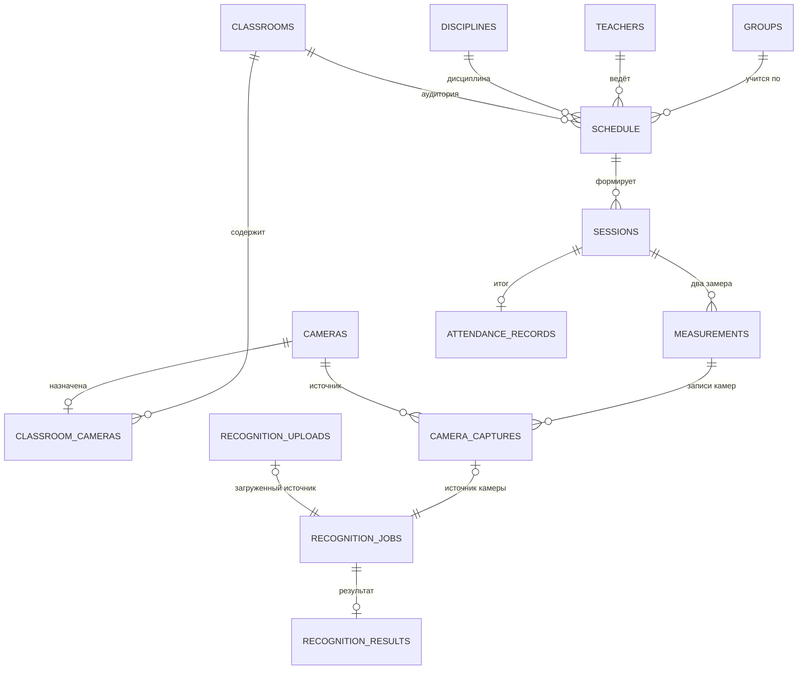
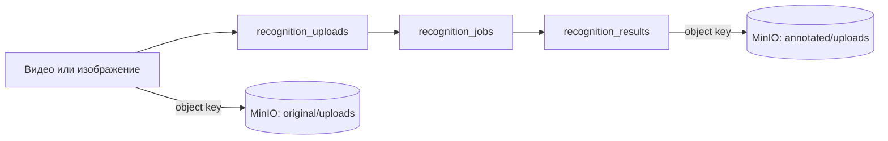
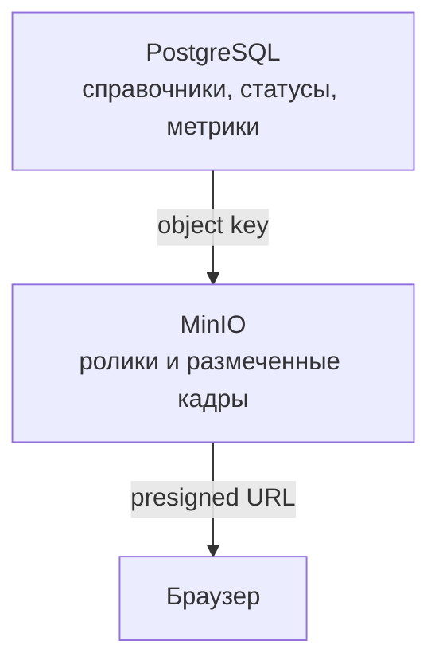

# Модель данных

PostgreSQL хранит учебные данные, очередь обработки и итоговые показатели.
Тяжёлые файлы в таблицы не попадают: для них сохраняются только bucket и object key
MinIO.

[К оглавлению](../README.md) · [Архитектура](architecture.md) · [Распознавание](recognition.md) · [API](api.md)

## ER-диаграмма

## Группы сущностей

| Группа | Таблицы | Назначение |
| --- | --- | --- |
| Учебные справочники | `groups`, `teachers`, `disciplines`, `classrooms` | исходные данные для расписания и аналитики |
| Камеры и расписание | `cameras`, `classroom_cameras`, `schedule`, `sessions` | связь пространства, времени и источников видео |
| Замеры | `measurements`, `camera_captures`, `attendance_records` | ход занятия и итог посещаемости |
| Распознавание | `recognition_uploads`, `recognition_jobs`, `recognition_results` | входные файлы, очередь, метрики и размеченный кадр |

## Распознавание без камер

`recognition_jobs` связан ровно с одним источником:

- `camera_capture_id` указывает на ролик, записанный с камеры;
- `upload_id` указывает на файл, загруженный через API.

Ограничение `ck_recognition_jobs_single_source` не позволяет создать задание без
источника или одновременно для камеры и ручной загрузки. Это сохраняет одну
очередь и единые правила lease, повторов и результатов.

## Основные поля

### Учебный контур

| Таблица | Поля, определяющие смысл |
| --- | --- |
| `groups` | `name`, `students_count`, `course`, `faculty` |
| `classrooms` | `number`, `capacity`, `aggregation_mode` |
| `schedule` | группа, преподаватель, дисциплина, аудитория, день, время и тип недели |
| `sessions` | ссылка на расписание, календарная дата и состояние занятия |
| `measurements` | `after_start` или `before_end`, плановое время, итоговое число людей |

### Контур обработки

| Таблица | Поля, определяющие смысл |
| --- | --- |
| `recognition_uploads` | имя файла, тип `image`/`video`, размер и расположение исходника в MinIO |
| `recognition_jobs` | состояние, владелец, lease, число попыток, частота кадров, порог уверенности |
| `recognition_results` | число людей, медиана, 75-й перцентиль, максимум, средняя уверенность и ключ размеченного кадра |

## Ограничения целостности

| Правило | Защита в БД | Практический смысл |
| --- | --- | --- |
| Один замер каждого типа на занятие | `uq_measurements_session_type` | нет дублей «после начала» и «перед концом» |
| Одна запись камеры на замер | `uq_camera_captures_slot` | повторный scheduler не создаёт второй ролик |
| Одно задание на источник | уникальные `camera_capture_id` и `upload_id` | один файл не обрабатывается параллельно как разные задания |
| Один результат на задание | `uq_recognition_results_job` | повторная фиксация не искажает метрики |
| Один источник задания | `ck_recognition_jobs_single_source` | единая очередь для камер и ручных файлов |
| Камеру с историей нельзя удалить | `RESTRICT` у `camera_captures.camera_id` | сохраняется проверяемая история результатов |

## Временные и постоянные данные

Исходные файлы относятся к префиксу `original/` и удаляются lifecycle-политикой
через 30 дней по умолчанию. Размеченные кадры находятся в `annotated/` и
хранятся 90 дней. Метрики результата остаются в PostgreSQL после удаления
медиа.
