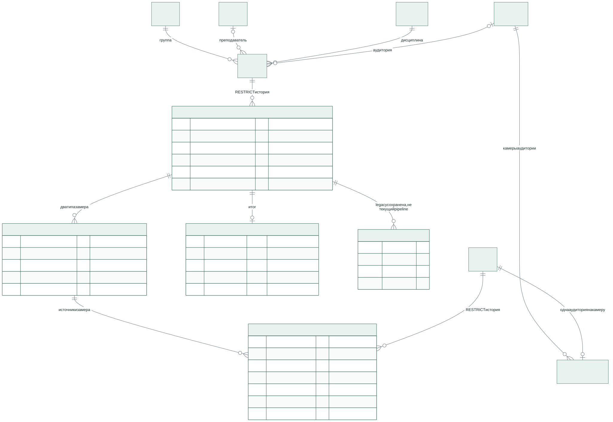
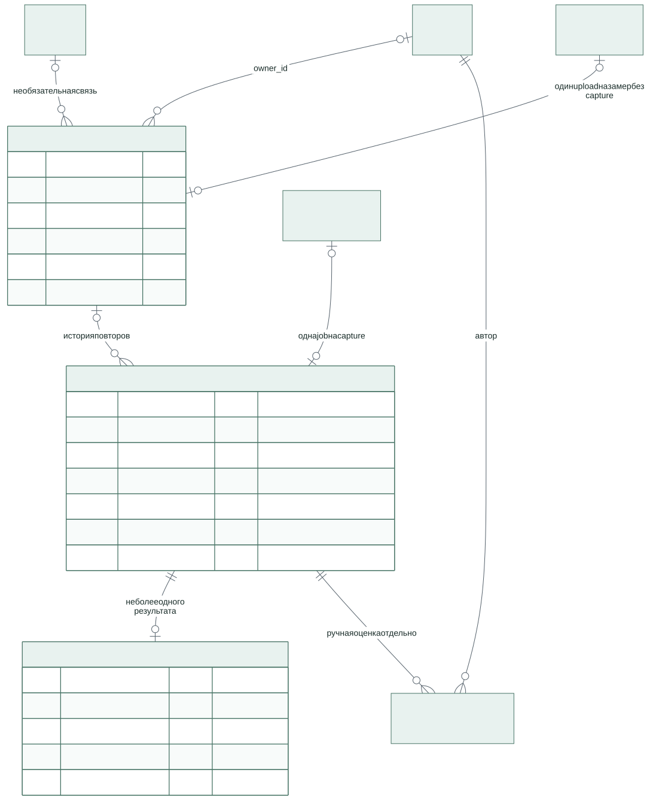
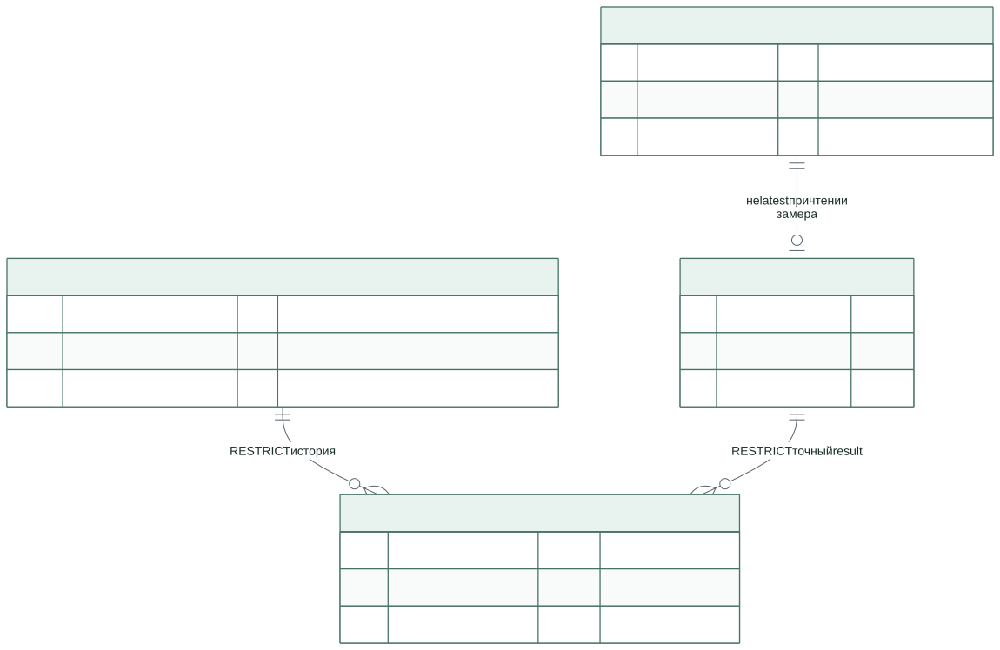
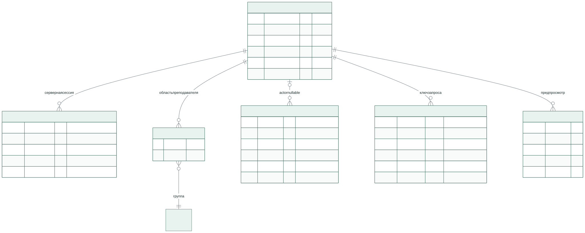

# Модель Данных

Источник схемы: [ORM-модели](../backend/app/models/) и
[миграции Alembic](../backend/alembic/versions/). PostgreSQL хранит данные и
состояния очередей; S3 хранит файлы. Object key не является публичной ссылкой.

## Учебный Контур



| Таблица | Смысл и инварианты |
| --- | --- |
| `groups` | Уникальное имя и students_count; не список студентов |
| `teachers`, `disciplines`, `classrooms` | Справочники; teacher не равен учётной записи users |
| `schedule` | Группа, optional teacher/classroom, дисциплина, день ISO 1–7, время, every/white/green |
| `sessions` | UNIQUE(schedule_id,date); scheduled/in_progress/finished/cancelled |
| `measurements` | UNIQUE(session_id,type); after_start/before_end; count допускает NULL |
| `cameras` | Зашифрованный RTSP URL, capture_group, enabled; API URL не выдаёт |
| `classroom_cameras` | Составной PK и UNIQUE(camera_id): максимум одна аудитория на камеру |
| `camera_captures` | UNIQUE(measurement_id,camera_id), claim/lease/attempts, ключ записи, snapshots role/priority/zone |
| `measurement_result_sources` | PK(measurement_id,recognition_result_id), used_for_count; точные источники финализации |
| `attendance_records` | Один итог на session; expected, counts, average, max, rate, calculation_status |
| `calendar_exceptions` | PK day; teaching, optional weekday/week_type, reason; переносы/выходные |
| `detection_snapshots` | Сохранённая legacy-таблица из 0001; текущий pipeline в неё не пишет |

UNIQUE(group_id,weekday,starts_at,week_type) в schedule не проверяет все интервалы.
API создания/импорта дополнительно проверяет пересечения группы, преподавателя
и аудитории с учётом чередования недели.

`expected_count_snapshot` и `aggregation_mode_snapshot` фиксируются при создании
session. Миграция 0006 заполняет старый expected из attendance или справочника.
Это реконструкция baseline, не восстановление потерянной истории. Capture с 0010
фиксирует role_snapshot, priority_snapshot, zone_code_snapshot и snapshot_origin.
Новые задания получают origin `captured`; backfill из текущей связи камеры
помечен `legacy_current_link`, отсутствующая связь `legacy_unknown`. Это не
полный snapshot названий и исторического расписания.

Rate = detected_average / expected_count при expected > 0. Значение выше 1
сохраняется; NULL означает неопределённый показатель. Сводка считает
sum(detected_average) / sum(expected_count) только по строкам с известным
detected и положительным expected. Partial не замещается нулём.

## Обработка И История



SQL CHECK требует ровно один источник job: camera_capture_id XOR upload_id.
На capture максимум одна job. UNIQUE(upload_id) снят миграцией 0008: ручной retry
создаёт новую job, автоматический увеличивает attempts той же job.
API upload.job показывает последнюю job, `/history` возвращает все jobs/corrections.
Пока новый retry не завершён, старый результат остаётся в истории.

UNIQUE(recognition_job_id) допускает один result на job. Raw count, метрики и
inference_metadata не перезаписываются API коррекции. `recognition_corrections`
содержит job, автора, число, причину и время; не заменяет исходный результат
в сводке качества или attendance автоматически.

Upload хранит owner, SHA256 файла, label, ручной эталон, optional session/measurement.
Миграция 0009 добавляет UNIQUE(measurement_id): максимум один upload на замер.
API проверяет принадлежность measurement к session, отсутствие capture/другого upload.
Составного SQL FK session/measurement нет, прямые записи требуют той же проверки.
Scheduler использует результат связанного upload для открытого замера без captures.
Один session_id без measurement_id не влияет на attendance. Терминальные замеры
и готовый attendance автоматически не пересчитываются после retry/correction.



Финализация записывает source_reference_status=`recorded` и ссылки на все
успешные результаты. used_for_count отмечает выбранные для числа результаты;
остальные могут участвовать в общей confidence. API source_results возвращает
recognition_result_id, recognition_job_id, upload_id либо camera_capture_id,
people_count и used_for_count. Эти ссылки не переключаются на latest job при retry.
Оба FK measurement_result_sources имеют RESTRICT: источник защищает и замер,
и recognition_result от прямого удаления. DB owner всё ещё может менять схему.
Для старых терминальных замеров 0010 ставит `legacy_unknown`, не выдумывая result ID.
`missing_input` означает отсутствие входа после deadline; это не распознанный ноль.

Claim token маркирует попытку capture/recognition. Завершение сверяет token,
worker, active state и lease. Status и result фиксируются одной SQL-транзакцией.
Фактические веса/runtime/параметры описаны inference_metadata результата,
не только строкой model_version job.

## Доступ И Запросы




| Таблица | Данные |
| --- | --- |
| `users` | Username, Argon2 hash, role, enabled, auth_version |
| `login_sessions` | Hash cookie как PK, user, CSRF, auth_version, expiry |
| `access_grants` | PK(user_id,group_id); scope преподавателя |
| `login_attempts` | Hash account/peer, attempts, начало окна throttle |
| `audit_events` | Actor, action, object type/id, reason, request_id, время; object_id не FK |
| `idempotency_records` | PK(owner_id,route,key), fingerprint, logical resource_id, expiry 24 часа |
| `import_previews` | UUID, owner, content, fingerprint, expiry 30 минут, confirmed |

Нет grants у teacher означает нет доступа к группам, не «все группы».
Собственный upload или upload разрешённой session входит в scope.
Прикладной аудит не криптографически неизменяем: DB owner способен изменить записи.

## Миграции И Удаление

Последовательность: 0001 initial, 0002 замеры/камеры, 0003 защита истории,
0004 uploads, 0005 метрики, 0006 доступ/snapshots, 0007 fencing/metadata,
0008 история повторов/preview, 0009 календарь/уникальная связь upload с замером,
0010 snapshots камер и точные источники замеров.
Legacy detection_snapshots сохраняется миграциями и отдельно учитывается при
проверке drift. Перед выпуском проверяйте фактический head.

Из backend/, с установленными requirements и отдельной тестовой PostgreSQL:

```bash
alembic heads
alembic current
alembic upgrade head
```

DDL выполняет schema owner, не runtime API. Для 0006–0010 automatic downgrade
запрещён: откат через совместимые образы либо проверенный backup/restore.
Создание ORM-таблиц в SQLite не подтверждает миграцию существующей PostgreSQL.

История session защищает schedule через RESTRICT, история capture защищает camera.
API отвечает 409 вместо удаления истории. Дочерние FK могут иметь CASCADE:
отсутствие HTTP DELETE не запрещает удаление DB owner.
Retentions метрик, аудита и резервных копий должен утвердить владелец.

Удаление S3-медиа не удаляет SQL-результат. Backend прекращает выдачу ссылок по
сроку, но это не доказательство физического удаления объекта. Default retention:
original 30 дней, annotated 90; policy устанавливает storage-init. Lifecycle
и целостность ссылок после restore проверяются отдельно.
