# Демонстрация

Статика, локальный inference и серверная обработка имеют разные источники
результата. Нельзя представлять fixture как успешное распознавание или действие
демо-роли как проверку серверных полномочий.



## Режимы

| Режим | Данные и обработка | Изоляция и ограничения |
| --- | --- | --- |
| Статика | Синтетический staticClient, provenance demo_fixture | API/БД/S3 не нужны, изменения только в памяти страницы |
| Browser inference | Свой разрешённый файл, ONNX/WASM Worker, browser_inference | Файл остаётся на устройстве; assets модели скачиваются с origin |
| Полный стенд | Настоящие cookie, PostgreSQL, S3, worker, server_inference | Отдельный project/database/bucket/credentials; нужны веса, IAM и TLS |

Browser inference доступен внутри того же frontend, это не второй продукт.
Его ошибка не заменяется готовым fixture. Камеры не нужны для upload-сценария.
Нет подтверждения полного стенда без S3, модели и сквозной проверки.

## Статика Без Контейнеров

Из корня repo, Node.js совместимый с закреплённым frontend toolchain и npm:

```bash
cd frontend
npm ci
npm run dev:demo -- --host 127.0.0.1 --port 4173 --strictPort
```

Открыть `http://127.0.0.1:4173/#/`. Если порт занят, задать другой свободный порт.
Ошибка `EADDRINUSE` не повод останавливать чужой процесс. Сервер остановить Ctrl+C.
Для сборки под Pages есть `npm run build:demo`; путь base `/edu-attendance-tracker/`
и каталог `dist-demo`. Это локальная сборка, не доказательство публикации Pages.

Фиксированная дата `DEMO_DATE = 2026-09-23`, timezone по умолчанию Europe/Moscow.
Сценарии формируются детерминированно из synthetic groups/schedule/date;
случайный seed не требуется. Перезагрузка страницы сбрасывает временные изменения
и выбранную демо-роль. Фиксированная дата не подменяет clock рабочего режима.
Статический импорт и серверная загрузка явно недоступны, не возвращают фиктивный успех.

Приватные учебные книги и старые фотографии не нужны. Не запускать старый
генератор из реального расписания для публичного демо. Для browser inference
использовать только самостоятельно подготовленный разрешённый материал;
схематичная synthetic-картинка проверяет UI, но не точность модели на людях.

## Полный Стенд

Нужны подготовленные immutable образы, PostgreSQL roles, private S3 bucket,
отдельные runtime/init credentials, TLS app/media hosts, проверенный MODEL_FILE
и SHA256, внешняя конфигурация mode 0600. Команды из корня repo:

```bash
python3 scripts/ops/manage.py --help
python3 scripts/ops/manage.py demo-up --env-file /secure/attendance-demo.env
python3 scripts/ops/manage.py demo-down --env-file /secure/attendance-demo.env
```

Это команды для подготовленной среды, не одношаговый bootstrap с дефолтными
паролями. `demo-up` валидирует ENVIRONMENT=demo, отдельное имя project/database/bucket,
loopback bind, файлы и hash модели; запрашивает подтверждение, запускает инфраструктуру,
storage-init, migrate и процессы. Создание IAM и реальное provision весов не
подменяется placeholders. `demo-down` не удаляет volumes.

См. [эксплуатацию](operations.md) для ролей, конфигурации и порядка запуска.

### Синтетические Справочники

До запуска процессов и bootstrap admin: создать отдельную demo-БД и настоящий
`ops_control.identity` штатной процедурой marker, затем применить миграции и grants.
Операторский env 0600 должен содержать `OPS_MODE=demo`, согласованные `OPS_NAMESPACE`,
`PGDATABASE`, `S3_BUCKET`, настоящий `OPS_INSTANCE_ID` и private PostgreSQL connection/
`PGPASSFILE`; формат см. [операторский env](../scripts/ops/backup.env.example).
Для seed S3 endpoint, ключи и restic не нужны: bucket name проверяется только как namespace.

```bash
make demo-seed OPS_ENV_FILE=/secure/attendance-demo-ops.env SEED_DATE=2026-09-23
```

Ввести подтверждение `seed attendance-demo-<имя>` с точным namespace из env.
Скрипт проверяет реальное имя БД и marker mode/namespace/UUID, не создаёт и не меняет marker.
Production запрещён независимо от CLI-флага. Транзакция блокирует таблицы и отказывает,
если любая application table уже содержит строки (кроме Alembic version); повторный запуск
тоже безопасно отказывает, ничего не очищает и не перезаписывает.
Создаются 2 synthetic groups, 1 teacher без email, 2 disciplines, 1 classroom и 2 schedule
slots 09:00–10:30 / 10:45–12:15 на ISO weekday указанной даты, `week_type=every`.
Дата обязательна; текущие часы не используются. Она не меняет semester/clock сервера.
Sessions, measurements, uploads, recognition/results и пользователи не создаются.
Admin bootstrap остаётся отдельным явным действием без пароля по умолчанию.

Для разрешённых negative image/video fixtures использовать synthetic blank inputs harness
`recognition/tests/run_model_smoke.py`; их успешная обработка не доказывает точность модели.
Нативная проверка в новой временной БД с cleanup:

```bash
TEST_DATABASE_URL=postgresql://attendance_test@127.0.0.1:55439/attendance_test make test-demo-seed
```

`data.py reset` является
guarded offline операцией, не HTTP-кнопкой; требует проверки маркера и namespace,
останавливает работу с данными, после него нужны миграции/grants/seed.
Не выполнять reset production и не использовать `docker compose down -v` как демо-сброс.

## Сценарий Показа



1. Открыть синтетический обзор и показать метку источника; числа не получены моделью.
2. Открыть занятие: сопоставить ноль, отсутствие результата и partial.
3. Открыть «Распознавание» и локальную проверку своего разрешённого файла.
   Дождаться реального результата либо показать конкретную ошибку модели/браузера.
4. Отменить обработку и повторить её; проверить, что UI остаётся отзывчивым.
5. Открыть аналитику, выбрать группу/период, скачать CSV и сверить строки таблицы.
6. Показать «Режим показа» admin в Layout: обзор → распознавание → первое занятие
   выбранной даты → аналитика той же группы за 14 дней. При отсутствии занятий
   показывается пустой список, не выдуманный ID. Назад/далее и Escape обратимы;
   «Вернуться к работе» восстанавливает исходный маршрут и фильтры. Fullscreen
   опционален. Режим доступен также в рабочем UI, но не расширяет permissions.
7. На отдельном полном стенде показать login, upload, очередь, history и короткую
   media URL. Только успешный реальный worker позволяет назвать этот шаг server inference.

Upload с measurement_id может стать источником открытого замера без captures;
одного session_id недостаточно. Закрытый attendance не пересчитывается от retry.
Preview/confirm импорта реализованы в API и диалоге SchedulePage; сквозной
показ требует полного стенда и не подтверждается статическими screenshots.
Отмена занятия отменяет связанные активные upload/camera jobs, новые upload/retry
для него запрещены. Замер без входа после конца занятия и grace (default час)
закрывается failed с NULL, а не фиктивным нулём.



Screenshots текущей последовательности: [обзор](diagrams/rendered/UI-presentation-1.png),
[распознавание](diagrams/rendered/UI-presentation-2.png),
[занятие](diagrams/rendered/UI-presentation-3.png),
[аналитика](diagrams/rendered/UI-presentation-4.png),
[мобильный показ](diagrams/rendered/UI-presentation-mobile.png).
Схема с 18 маркерами на экране распознавания является самостоятельным fixture,
не источником посещаемости следующего занятия и не model inference.

Свежие screenshots UI создаются по инструкции [тестирования](testing.md), только
на synthetic data. Не использовать старые report-assets как evidence новой ревизии.
