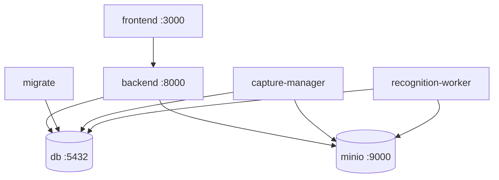

# Эксплуатация

Документ описывает запуск сервисов, настройку распознавания и проверку
состояния системы.

[К оглавлению](../README.md) · [Архитектура](architecture.md) · [Распознавание](recognition.md) · [API](api.md)

## Состав Docker Compose



| Сервис | Порт | Роль |
| --- | --- | --- |
| `frontend` | `3000` | браузерный интерфейс и прокси API |
| `backend` | `8000` | API, Swagger, scheduler и выдача временных ссылок |
| `db` | `5432` | PostgreSQL 16 |
| `minio` | `9000`, `9001` | S3-совместимое хранилище и консоль |
| `migrate` | нет | однократное применение Alembic-миграций |
| `capture-manager` | нет | будущая запись RTSP-потоков |
| `recognition-worker` | нет | обработка файлов и роликов камер |

## Первый запуск

```bash
cp .env.example .env
docker compose up -d --build
docker compose ps
curl http://localhost:8000/health
```

Ожидаемый ответ health endpoint: `{"status":"ok"}`. Контейнер `backend`
стартует только после успешного завершения `migrate`.

## Работа с файлами распознавания

На текущем этапе для запуска обработки не нужны камера, расписание или
аудитория. Достаточно поднять `backend`, `db`, `minio` и
`recognition-worker`.

```bash
docker compose up -d db minio migrate backend recognition-worker
```

Загрузите файл через Swagger или команду из [описания API](api.md). Наблюдать
за обработкой можно в логах:

```bash
docker compose logs -f recognition-worker
docker compose logs -f backend
```

## Параметры окружения

| Переменная | Назначение | Значение по умолчанию |
| --- | --- | --- |
| `RECOGNITION_UPLOAD_MAX_SIZE_MB` | максимальный размер видео или изображения | `512` |
| `MODEL_PATH` | имя весов из каталога Ultralytics или путь к файлу весов | `yolov8n.pt` |
| `DOWNLOAD_MODEL` | скачивать веса при сборке образа | `true` |
| `RECOGNITION_MODEL_NAME` | имя, записываемое вместе с заданием | `yolov8n` |
| `INFERENCE_IMAGE_SIZE` | размер входа детектора | `960` |
| `INFERENCE_IOU_THRESHOLD` | порог подавления пересекающихся рамок | `0.5` |
| `INFERENCE_MAX_DETECTIONS` | предел числа найденных людей на кадре | `300` |
| `TIMEZONE` | часовой пояс расписания | `Europe/Moscow` |

При подключении более крупных или дообученных весов измените `MODEL_PATH`,
`RECOGNITION_MODEL_NAME` и `RECOGNITION_MODEL_VERSION` согласованно. Для файла
в volume-монтаже выставьте `DOWNLOAD_MODEL=false`, чтобы образ не пытался
скачать его во время сборки.

## Масштабирование

Распознавание масштабируется независимо от backend:

```bash
docker compose up -d --scale recognition-worker=3
```

Воркер захватывает одно задание атомарно через PostgreSQL. Связка
`FOR UPDATE SKIP LOCKED`, `worker_id`, `lease_until` и heartbeat не даёт двум
процессам завершить одну задачу. После падения worker задание возвращается в
очередь или отмечается ошибкой после исчерпания попыток.

## Диагностика

```bash
docker compose ps
docker compose logs --tail=200 backend recognition-worker
docker compose exec db psql -U attendance -d attendance \
  -c "SELECT id, status, attempts, error FROM recognition_jobs ORDER BY id DESC LIMIT 20"
docker compose exec minio mc ls local/attendance-clips/original/uploads
```

Если задание остаётся в `pending`, проверьте, что запущен хотя бы один
`recognition-worker`. Если оно находится в `retry_wait`, изучите поле `error`
и доступность исходного объекта в MinIO.

## Резервное копирование и очистка

- резервируйте том PostgreSQL: в нём находятся статусы, метрики и история;
- резервируйте MinIO, если исходные ролики и кадры нужны дольше заданного срока;
- lifecycle MinIO удаляет `original/` через 30 дней и `annotated/` через 90;
- проверяйте, что эти сроки соответствуют политике вуза.

## GitHub Pages

Workflow `.github/workflows/pages.yml` собирает статическую демонстрационную
версию при push в `develop`. Она использует `demo-data.json`, поэтому не
запускает backend или worker и не предназначена для проверки распознавания.
