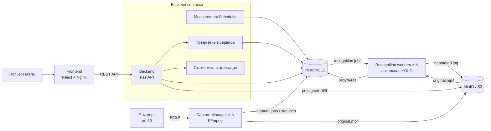
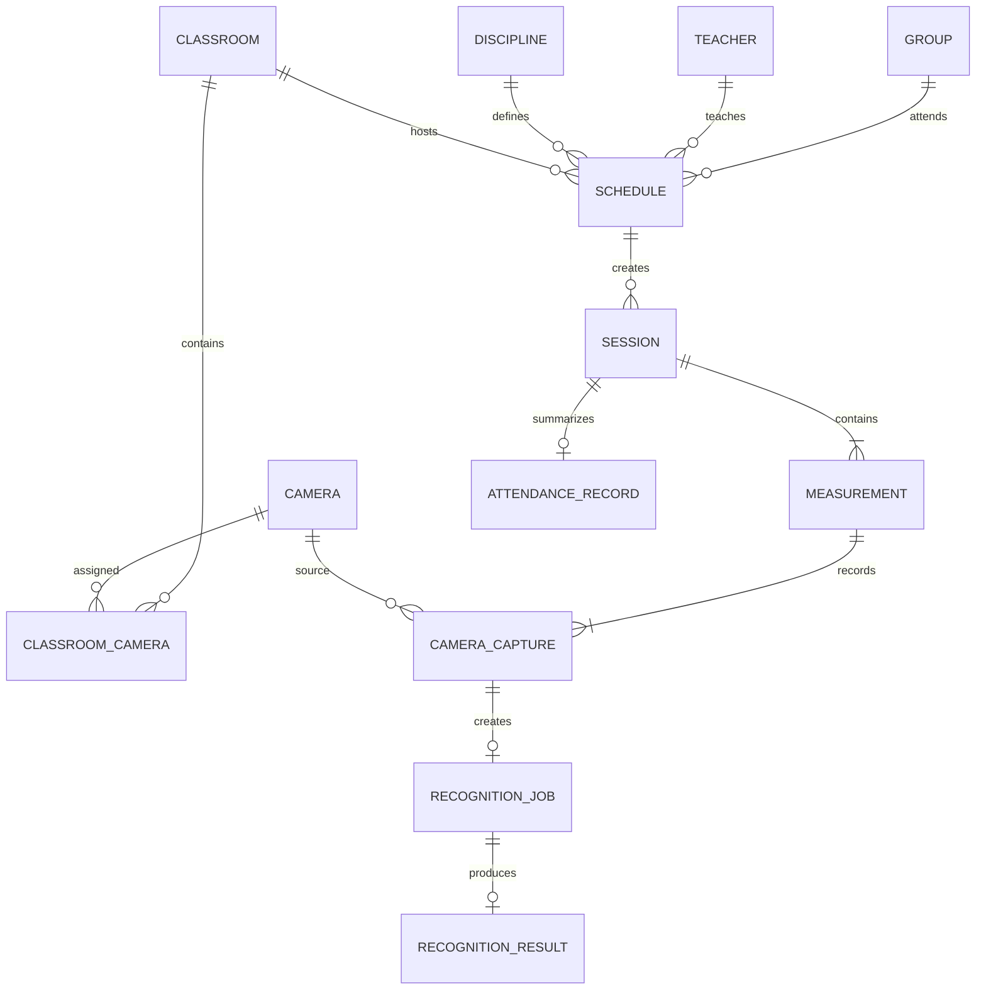
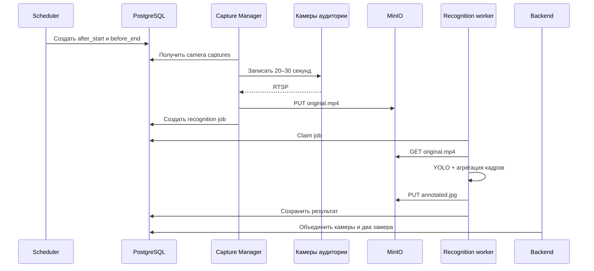

# Система контроля посещаемости учебных занятий

## 1. Назначение проекта

Система автоматизирует сбор и анализ посещаемости учебных занятий. Она
объединяет расписание, справочники учебного процесса, IP-камеры, пакетное
распознавание людей и веб-интерфейс статистики.

Для каждого занятия выполняются два замера:

```text
первый  — через 15 минут после начала;
второй  — за 15 минут до окончания.
```

В одной аудитории используется одна или две камеры. В один временной интервал
система может опрашивать до 50 камер. Видеофрагменты записываются приблизительно
одновременно, но распознаются асинхронно без строгого требования к задержке.

## 2. Функциональные возможности

- ведение групп, преподавателей, дисциплин и аудиторий;
- хранение одной или двух камер для аудитории;
- импорт и редактирование расписания;
- создание конкретных занятий по расписанию;
- автоматическое планирование двух замеров;
- параллельная запись видео с IP-камер;
- хранение роликов в MinIO;
- очередь заданий распознавания в PostgreSQL;
- горизонтальное масштабирование Capture Manager и recognition workers;
- подсчёт людей локальной моделью YOLO;
- агрегация результатов нескольких кадров;
- сохранение одного размеченного кадра;
- объединение результатов двух камер;
- расчёт итоговой посещаемости занятия;
- метрики по группам, преподавателям и дисциплинам;
- отображение динамики посещаемости;
- просмотр исходного видео и размеченного кадра в пределах срока хранения.

## 3. Архитектура



Логические компоненты могут сначала работать на одном Docker-хосте, а позднее
быть перенесены на разные физические серверы.

## 4. Компоненты

### Frontend

React-приложение предоставляет:

- расписание и список занятий;
- состояние двух замеров;
- показатели посещаемости;
- аналитику по группе;
- аналитику по преподавателю;
- аналитику по дисциплине;
- графики динамики по датам;
- просмотр размеченного кадра;
- временный доступ к исходному видео.

Frontend работает только через Backend API.

### Backend

FastAPI является единой внешней точкой системы:

- управляет справочниками;
- импортирует расписание;
- формирует занятия;
- предоставляет REST API;
- рассчитывает итог занятия;
- выполняет статистические запросы;
- выдаёт временные ссылки MinIO;
- управляет миграциями БД.

### Measurement Scheduler

Scheduler можно запускать внутри единственного backend-процесса. Он создаёт два
`Measurement` на занятие:

```text
after_start = starts_at + 15 минут
before_end  = ends_at - 15 минут
```

Уникальность `(session_id, measurement_type)` защищает от дубликатов после
перезапуска.

### Capture Manager

Capture Manager работает отдельным процессом или контейнером:

- получает ожидающие `camera_captures`;
- группирует задания с близким `planned_at`;
- почти одновременно запускает FFmpeg;
- пишет 20–30 секунд видео;
- по возможности использует `-c copy`;
- проверяет ролик;
- загружает его в MinIO;
- создаёт задание распознавания.

Capture Manager масштабируется по сетевым зонам или корпусам:

```text
capture-building-a
capture-building-b
```

### Recognition workers

Каждый worker запускается в отдельном контейнере:

1. атомарно получает job через `FOR UPDATE SKIP LOCKED`;
2. напрямую скачивает ролик из MinIO;
3. сохраняет временную локальную копию;
4. выбирает 1–2 кадра в секунду;
5. обрабатывает кадры локальной моделью YOLO;
6. рассчитывает медиану или 75-й перцентиль;
7. сохраняет один репрезентативный `annotated.jpg`;
8. записывает результат в PostgreSQL;
9. удаляет временный ролик.

Количество workers изменяется независимо:

```text
recognition-worker-1
recognition-worker-2
...
recognition-worker-N
```

### PostgreSQL

PostgreSQL хранит:

- группы;
- преподавателей;
- дисциплины;
- аудитории и камеры;
- расписание;
- занятия;
- measurements;
- задания записи;
- задания распознавания;
- результаты;
- итоговую посещаемость.

PostgreSQL также выполняет роль надёжной очереди. `lease_until`,
`heartbeat_at`, `attempts` и `worker_id` позволяют восстанавливать задания после
сбоя.

### MinIO

MinIO является S3-совместимым объектным хранилищем:

```text
original/sessions/{session_id}/measurements/{measurement_id}/cameras/{camera_id}.mp4
annotated/sessions/{session_id}/measurements/{measurement_id}/cameras/{camera_id}.jpg
```

Capture Manager загружает исходные ролики. Recognition workers напрямую
скачивают их и загружают размеченные кадры. Backend создаёт presigned URL для
frontend.

Lifecycle policy автоматически удаляет медиа, например через 30 дней.
Числовые результаты в PostgreSQL сохраняются.

## 5. Предметная модель



Главная цепочка аналитики:

```text
AttendanceRecord
    → Session
        → Schedule
            ├── Group
            ├── Teacher
            ├── Discipline
            └── Classroom
```

Благодаря этой связи итог каждого занятия участвует в статистике нужной группы,
преподавателя и дисциплины.

Подробная модель находится в `docs/target-data-model.md`.

## 6. Обработка одного занятия



## 7. Две камеры в аудитории

Режим задаётся в конфигурации аудитории:

```text
single         — одна камера;
maximum        — пересекающиеся зоны, берётся максимум;
sum            — непересекающиеся зоны, результаты суммируются;
primary_backup — основная и резервная камеры.
```

Автоматически складывать результаты пересекающихся камер нельзя: один человек
может попасть в оба кадра.

## 8. Расчёт результата

Для каждого ролика сохраняются:

- итоговое количество людей;
- медиана;
- 75-й перцентиль;
- максимум;
- средняя confidence;
- число проанализированных кадров;
- временная позиция репрезентативного кадра;
- object key размеченного изображения;
- версия модели.

Для занятия сохраняются оба замера:

```text
after_start_count
before_end_count
detected_average
detected_max
attendance_rate
```

Начальная формула:

```text
detected_average = average(успешные замеры)
attendance_rate = min(detected_average / students_count, 1.0)
```

## 9. Метрики

### По группе

- число проведённых занятий;
- среднее количество присутствующих;
- средняя доля посещаемости;
- динамика по датам;
- посещаемость по дисциплинам;
- число полных и частичных измерений.

### По преподавателю

- число проведённых занятий;
- средняя посещаемость;
- динамика по датам;
- сравнение групп и дисциплин;
- доля занятий с ошибками измерения.

### По дисциплине

- средняя посещаемость;
- динамика по датам;
- сравнение групп;
- сравнение преподавателей.

На первом этапе метрики рассчитываются SQL-запросами. Позднее можно добавить
materialized views:

```text
group_attendance_daily
teacher_attendance_daily
discipline_attendance_daily
```

## 10. Надёжность

- уникальные ограничения предотвращают дубли;
- jobs выдаются через `FOR UPDATE SKIP LOCKED`;
- lease возвращает зависшее задание в очередь;
- повторные операции используют стабильный object key;
- отказ одной камеры не блокирует другие;
- measurement может завершиться частично;
- MinIO и PostgreSQL используют постоянные диски и резервное копирование;
- время серверов и камер синхронизируется через NTP.

## 11. Безопасность

- RTSP credentials не передаются во frontend;
- MinIO bucket закрыт;
- frontend получает только временные presigned URL;
- backend, capture и recognition используют разные роли PostgreSQL;
- Capture Manager имеет право записи исходных видео;
- recognition имеет право чтения видео и записи annotated-кадров;
- соединения между хостами защищаются TLS;
- старые медиа удаляются lifecycle policy;
- доступ к изображениям учитывает требования к персональным данным.

## 12. Развёртывание

Начальная конфигурация на одном Docker-хосте:

```text
frontend
backend + scheduler
capture-manager
recognition-worker × N
postgres
minio
```

Распределённая конфигурация:

```text
Web host:
  frontend
  backend + scheduler

Infrastructure host:
  PostgreSQL
  MinIO

Camera network:
  Capture Manager × N

Compute host:
  Recognition workers × N
```

Capture и recognition расширяются горизонтально независимо. Backend при
исходных требованиях может оставаться единственным экземпляром.

## 13. Связанные документы

- `docs/50-camera-batch-architecture.md` — архитектура массового опроса камер;
- `docs/target-data-model.md` — полная модель данных;
- `docs/recognition-architecture-summary.md` — краткое архитектурное резюме;
- `output/pdf/attendance_architecture_scheme.pdf` — структурная PDF-схема.

