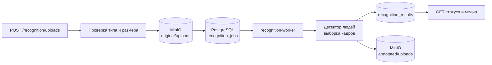
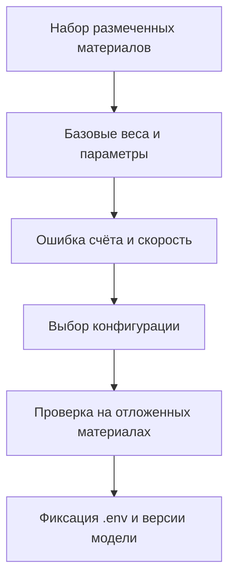
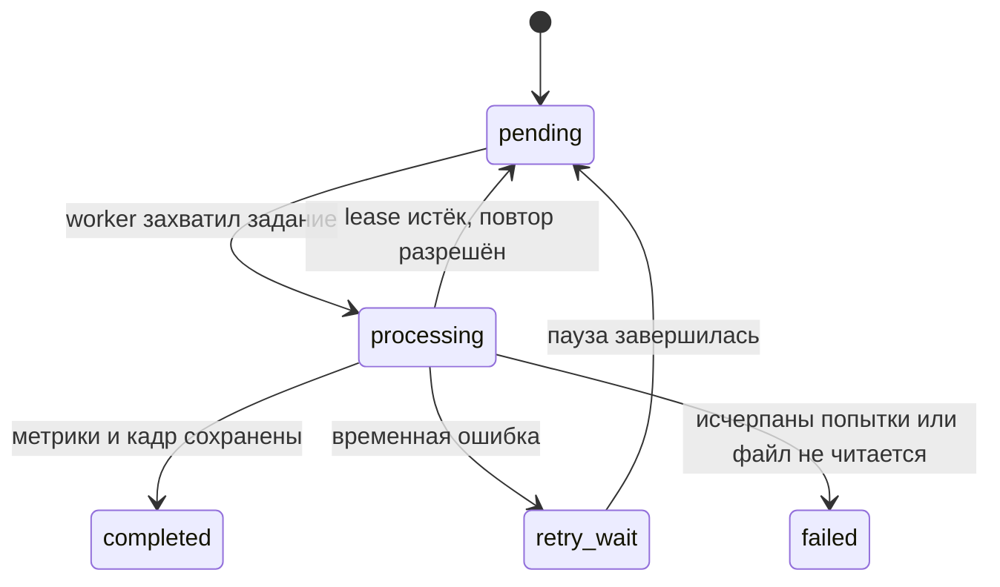

# Распознавание по видео и изображениям

Текущий приоритет проекта — надёжная обработка вручную загруженных материалов
без ожидания доступа к IP-камерам. Этот режим использует тот же worker и ту же
очередь, что и будущий камерный контур, поэтому результаты и проверка качества
не потеряются при подключении RTSP.

[К оглавлению](../README.md) · [Архитектура](architecture.md) · [API](api.md) · [Эксплуатация](operations.md)

## Что делает сервис

Сервис считает людей на изображении или в серии кадров ролика. Он сохраняет:

- итоговое число людей;
- медиану, 75-й перцентиль и максимум по кадрам видео;
- среднюю уверенность найденных объектов;
- число обработанных кадров;
- размеченный JPEG, соответствующий итоговому числу людей.

Сервис не устанавливает личность человека и не заменяет учёт по списку
студентов. Его результат — объективная оценка количества людей в кадре, из
которой позднее рассчитывается посещаемость относительно численности группы.

## Полный путь файла

## Поддерживаемый вход

| Тип | Форматы | Обработка |
| --- | --- | --- |
| Изображение | `JPG`, `PNG`, `WebP` | один кадр, `sampled_frames = 1` |
| Видео | `MP4`, `MOV`, `AVI`, `WebM` | равномерная выборка кадров с частотой `sample_rate_fps` |

Backend проверяет расширение, `Content-Type`, пустой файл и лимит размера до
создания задания. Исходный файл сохраняется под случайным ключом, поэтому имя
пользовательского файла не становится путём в MinIO.

## Как выбрать параметры

| Параметр | Рекомендация | Влияние |
| --- | --- | --- |
| `confidence_threshold` | начать с `0.35`; снижать при мелких людях, повышать при ложных срабатываниях | баланс пропусков и лишних рамок |
| `sample_rate_fps` | `1` для спокойной аудитории, `2-3` при активном движении | стабильность медианы и время обработки |
| `INFERENCE_IMAGE_SIZE` | `960` для деталей; снижать на слабом CPU | точность на мелких объектах и потребление ресурсов |
| `MODEL_PATH` | базовые или более крупные веса, прошедшие проверку на ваших кадрах | основное влияние на качество и скорость |
| `INFERENCE_MAX_DETECTIONS` | не ниже ожидаемой вместимости аудитории | исключает искусственное ограничение результата |

Для ролика итог берётся как медиана по выбранным кадрам. Это устойчивее одного
случайного кадра при входе людей, кратком перекрытии обзора или движении перед
камерой. Размеченный кадр выбирается с числом людей, максимально близким к
медиане, а при равенстве — ближе к центру ролика.

## Настройка и проверка качества

1. Соберите набор кадров и роликов из целевых аудиторий с известным числом людей.
2. Разделите материалы по условиям: освещение, расстояние, заполненность,
   ракурс и перекрытия.
3. Для каждого варианта весов и параметров сохраните абсолютную ошибку
   `|найдено - фактически|` и долю кадров с ошибкой не более одного человека.
4. Отдельно проверьте переполненную аудиторию: `INFERENCE_MAX_DETECTIONS`
   должен быть выше наблюдаемого максимума.
5. Зафиксируйте выбранные значения в `.env` и повторите тест на отложенной
   части набора, которую не использовали для подбора.

Сохраняйте модель, её версию и параметры вместе с каждым заданием. Это позволяет
сравнивать результаты повторяемо, а не по памяти о том, как была настроена
среда в день эксперимента.

## Статусы задания

Проверить состояние можно через `GET /api/v1/recognition/uploads/{id}`. Для
готового результата endpoint `.../{id}/media` выдаст временные ссылки на
оригинал и размеченный кадр.
