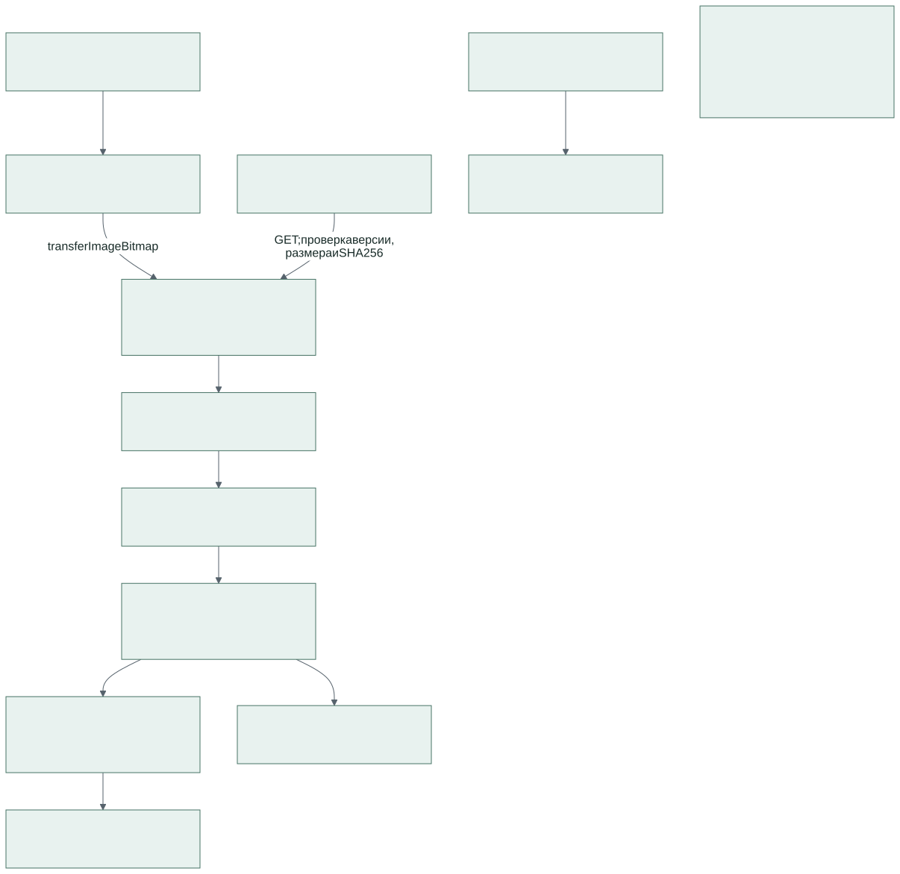

# Распознавание

Результат модели является оценкой числа людей, не идентификацией и не
доказательством присутствия студента. Средняя confidence рамок не означает
вероятность правильного итогового числа.

[API](api.md) · [Демо](demo.md) · [Проверки](testing.md) · [Очередь](architecture.md)

## Происхождение

| Метка | Что произошло |
| --- | --- |
| `demo_fixture` | Число задано синтетическим сценарием, inference не выполнялся |
| `browser_inference` | ONNX/WASM inference локального кадра в Worker |
| `server_inference` | Серверный pipeline выполнил модель; сохранение в S3/SQL требует отдельного подтверждения |

Ошибка модели или отсутствие весов не должны заменяться fixture.
Unit-тест со stub-детектором проверяет pipeline, не настоящие веса и точность.

Сохранены успешные реальные smoke-прогоны на синтетических материалах:
[browser Worker под subpath](../frontend/tests/browserRecognition-smoke.json),
[настоящий UI image/video](../frontend/tests/browserRecognition-ui-smoke.json)
и [server CPU image/video](../recognition/tests/model-smoke-evidence.json).
Они подтверждают исполнение модели, но не качество подсчёта людей, S3/SQL
интеграцию или Linux sandbox. Текущий CPU evidence использует Torch 2.13.0 и
torchvision 0.28.0. Dependency audit зафиксировал 0 известных advisories, включая
отдельную проверку upstream-версий CPU wheels; это не binary/OS audit и не
доказательство отсутствия уязвимостей. Актуальный допуск: [readiness](production-readiness.md).

## Серверный Вход

Изображения: JPEG, PNG, WebP. Видео: MP4, MOV, AVI, WebM.
Backend проверяет расширение/MIME, размер, содержимое Pillow/FFprobe и пределы
декодирования. Контейнер файла не гарантирует поддержку конкретного codec.

| Настройка API | Default |
| --- | --- |
| RECOGNITION_UPLOAD_MAX_SIZE_MB | 100 MiB; body limit имеет отдельный запас 1 MiB |
| UPLOAD_MAX_PIXELS | 16 000 000 |
| UPLOAD_MAX_DURATION_SECONDS | 120 секунд |
| UPLOAD_MAX_VIDEO_DIMENSION | 3840 пикселей |
| UPLOAD_PROBE_TIMEOUT_SECONDS | 10 секунд |
| sample_rate_fps | 1; диапазон 0.1–10 |
| confidence_threshold | 0.35; диапазон 0.05–0.95 |
| reference_people_count | Optional целое 0–1000 |

`GET /api/v1/recognition/capabilities` сообщает лимиты API. Worker имеет отдельные
лимиты; проверяйте оба процесса. 202 не проверяет заранее доступность модели.

## Серверная Модель

[Детектор](../recognition/app/detector.py) требует локальный .pt и MODEL_SHA256
из доверенного канала. Он копирует веса в приватный временный файл, сверяет hash
и загружает проверенную копию. Отсутствующие веса не скачиваются автоматически.
Hash фиксирует байты, но не происхождение, безопасность checkpoint и права.
Не принимать пользовательский .pt как модель.

| Worker setting | Default |
| --- | --- |
| MODEL_PATH | /models/yolov8n.pt; Compose монтирует /models/model.pt |
| MODEL_SHA256 | Пустой hash не допускает inference |
| INFERENCE_IMAGE_SIZE | 960 |
| INFERENCE_IOU_THRESHOLD | 0.5 |
| INFERENCE_MAX_DETECTIONS | 300 |
| MAX_SAMPLED_FRAMES | 180 |
| JOB_TIMEOUT_SECONDS | 300 |
| CPU_LIMIT_SECONDS / MEMORY_LIMIT_MB | 240 / 4096; container limits могут быть ниже |
| EVALUATION_TOLERANCE_PEOPLE | 1 |

Выбирается COCO person, ID 0. Изображение даёт один кадр. Для видео число sampled
frames ограничено; итог равен округлённой медиане. Сохраняются p75, max,
population stddev, confidence, количество кадров, длительность и время
representative frame. Кадр выбирается близко к медиане, при равенстве ближе к
центру видео. Tracking уникальных людей между кадрами не выполняется.

Inference metadata содержит фактический hash, runtime/version, image size,
IoU, max detections и параметры обработки. model_name/model_version job сами
по себе не доказывают одинаковые веса двух запусков.


## Браузерная Модель



Точный контракт: [model manifest](../frontend/public/models/manifest.json) и
[browserRecognitionCore](../frontend/src/lib/browserRecognitionCore.ts).
ORT 1.22.0, WASM, один поток. Assets загружаются с origin сайта; пользовательское
медиа через этот pipeline не отправляется. Первый запуск не является offline.

Модель yolov8n-coco-browser, 12 756 454 байта, SHA256:

```text
353ca4ab4fa9d4e5499d3300912faa30dae49718f90be8a159ff6af09a4e66b7
```

Input images: float32 [1,3,640,640], RGB/255, NCHW, letterbox цветом 114.
Output output0: [1,84,8400] либо [1,8400,84]; person score channel 4.
Confidence 0.1–0.9, default 0.35; greedy NMS IoU 0.45. Неподдерживаемые формы,
NaN и неверные confidence отклоняются. Обратные координаты учитывают округлённый resize.

Лимиты браузера: image 20 MiB, video 200 MiB, 16 MP, сторона 8192,
длительность 600 s, операция Worker 120 s. Нужны secure localhost/HTTPS,
OffscreenCanvas, Web Crypto. Отмена завершает Worker и pending requests;
bitmap/tensors освобождаются. Video pipeline берёт текущие декодированные кадры,
не гарантирует серверную выборку или идентичный итог.

Manifest фиксирует существующий ONNX, но цепочка исходных weights/export не
проверена независимо. Embedded license AGPL-3.0, runtime MIT: решение о
публикации принимает владелец после проверки происхождения и обязательств.
.onnx.data не загружается, поскольку у графа нет external initializers.

## Качество

При эталоне сохраняются abs(predicted-reference), relative error и попадание
в допуск. При reference=0 relative error равна NULL; absolute error определена.
Без эталона ошибки NULL. Нулевой stddev одного кадра не означает точность.

Evaluation summary учитывает только последнюю job каждого upload, если она
завершена и результат содержит ошибку относительно эталона. Pending/failed retry
исключает старый результат из summary, но не удаляет его из history. Повторная
загрузка одного материала всё ещё не является независимым holdout-примером.
Коррекция не становится независимой разметкой автоматически.

Для допуска нужны разрешённые материалы целевых условий, ручная разметка до
inference, отдельные calibration/holdout наборы, hashes и параметры, ошибки по
ракурсу/свету/заполненности/перекрытиям, замеры времени. Приватные фотографии не
публикуются. Подтверждённой точности на аудиториях эта документация не заявляет.
