# Границы Безопасности

Это описание реализованных контролей и оставшихся проверок, не сертификат
безопасности. Перед обработкой реальных занятий владелец определяет допустимые
данные, круг доступа, сроки хранения и условия использования модели.



## Доступ

Пароли хешируются Argon2. Сервер хранит SHA256 непрозрачного cookie token,
expiry, CSRF token и auth_version; не raw cookie. Cookie HttpOnly, Secure,
SameSite=Strict, TTL default 8 часов. Unsafe-запросы требуют X-CSRF-Token.
Login проверяет Origin и отдельно ограничивает попытки по account
(`LOGIN_LIMIT=8`) и фактическому peer (`LOGIN_PEER_LIMIT=1000`) за
`LOGIN_WINDOW_SECONDS=900`. Backend не доверяет подставленным forwarded headers.
За proxy peer общий, поэтому у него отдельный бюджет, не восемь входов на весь
вуз. Внешний gateway дополнительно ограничивает login по реальному remote IP:
10 запросов в минуту, burst 5, HTTP 429. Значения нужно согласовать с нагрузкой
и NAT учреждения; это не распределённая anti-abuse система. При добавлении
внешнего балансировщика его доверенные адреса и ограничения проверяют отдельно.

Смена пароля, роли, enabled или grants увеличивает auth_version, отзывая сессии.
Logout удаляет текущую сессию. Teacher scope задаётся access_grants по группам
и применяется к ORM-чтениям списков, detail, joins, stats и media. Собственный
upload или upload разрешённой session доступен teacher. Analyst получает
агрегаты, но не raw media. Матрица методов приведена в [API](api.md).

Проверки интерфейса не являются контролем доступа. Raw SQL новых endpoint-ов
не получает ORM criteria автоматически: такие запросы требуют отдельного
review и negative-тестов. Тесты SQLite не проверяют PostgreSQL concurrency;
актуальное evidence фиксируется общим владельцем проверки.

Первый admin создаётся offline из backend/, при настроенной БД и зависимостях:

```bash
python -m app.admin administrator
```

Пароль вводится через TTY дважды, 12–256 символов, не через аргумент командной
строки. При существующем admin bootstrap откажет; используйте управление доступом.
Не создавать общий публичный production password для демонстрации.

## Файлы И Камеры

HTTP middleware ограничивает фактически полученные bytes, не только Content-Length.
Backend проверяет формат/размер, Pillow decode, FFprobe с timeout и file-only
protocol; XLSX проверяет ZIP expansion, размеры таблиц, формулы, макросы,
external links и DTD. Worker повторно ограничивает декодирование и выполняет
inference в дочернем процессе с timeout/resource limits. Это не доказательство
отсутствия уязвимостей в нативных библиотеках: нужны обновления и сканирование.

Пользовательский filename не используется как S3 path. Bucket закрыт; API выдаёт
короткоживущие signed GET только после проверки полномочий. Default TTL 120 секунд.
Уже выданная URL остаётся bearer-доступом до expiry даже после logout или отзыва
роли. Её нельзя публиковать, писать в analytics, screenshots и общие логи.

RTSP credentials шифруются Fernet внешним CAMERA_ENCRYPTION_KEY. Ответ API
содержит пустой rtsp_url, не зашифрованную строку и не «маскированный» пароль.
Для изменения нужно передать новый URL. Разрешены literal IP, схема rtsp и
явные CAMERA_ALLOWED_CIDRS; DNS-имена и специальные адреса отклоняются.
Capture повторно проверяет адрес. Пустой allowlist закрывает камерный контур.
Firewall/egress rules остаются обязательной внешней границей; allowlist не
является разрешением на сканирование сети. Старые plaintext записи требуют
контролируемого переввода перед production capture.

## Секреты И Эксплуатация

Production config требует Secure cookie, HTTPS media, явные hosts/origins и
отказ от development credentials. Compose использует отдельные DSN runtime,
workers и migration owner, отдельные S3 root/init/runtime credentials.
Реальность IAM проверяется действиями под каждой ролью, не именами переменных.
Runtime не должен создавать bucket или lifecycle; это отдельный storage-init.

Закрытая private network, read-only containers и resource limits описаны
Compose; это не результат проверки live deployment. Backup должен включать
БД, объекты и конфигурацию, а ключ шифрования камеры храниться отдельно с
контролируемым восстановлением. Без него RTSP credentials после restore недоступны.

Default media retention: original 30 дней, annotated 90. SQL metadata, audit,
login_attempts, previews и idempotency записи не имеют единого автоматического
retention-контура. Владелец должен утвердить отдельные сроки и purge-процедуры,
включая резервные копии. Timestamp в API не доказывает физическое удаление S3.

Audit фиксирует входы, отказ login, изменения объектов и доступа, corrections;
содержит request_id и причину там, где она требуется. Нет внешнего append-only
архива, запрета DB owner на изменение журнала и гарантии аудита каждого отказа.
Не называть его tamper-proof или полным журналом безопасности.

## Оставшийся Допуск

- Реальные S3 IAM, TLS media, lifecycle, поведение при сбое и согласованный restore.
- Проверенные веса и право их распространения; hash не заменяет provenance.
- Полный сквозной upload/inference и negative-тесты production конфигурации.
- Полнота rate limits/quotas: новые uploads ограничены 20 активными jobs на владельца
  по умолчанию; это не квота байтов хранилища и не общий limiter всех endpoints.
- Сроки хранения SQL и backup, ротация ключей/паролей, независимый security review.

О приватной уязвимости сообщать владельцу через согласованный закрытый канал.
Публичный адрес security-contact этим документом не объявляется: он ещё должен
быть утверждён. Не публиковать payload с реальными credentials и учебными медиа.
