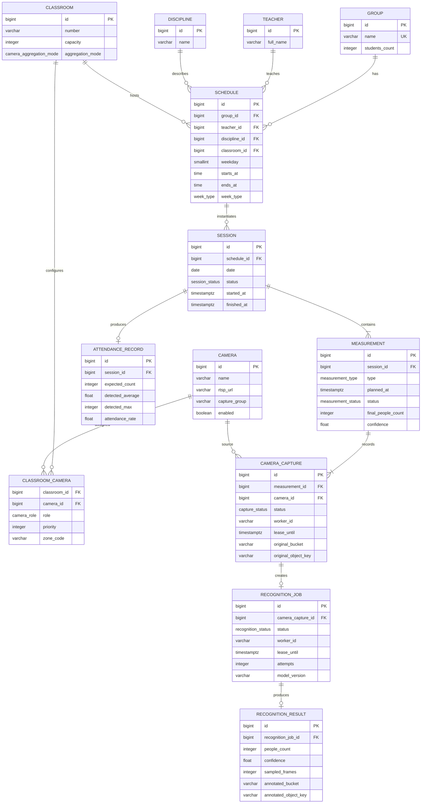
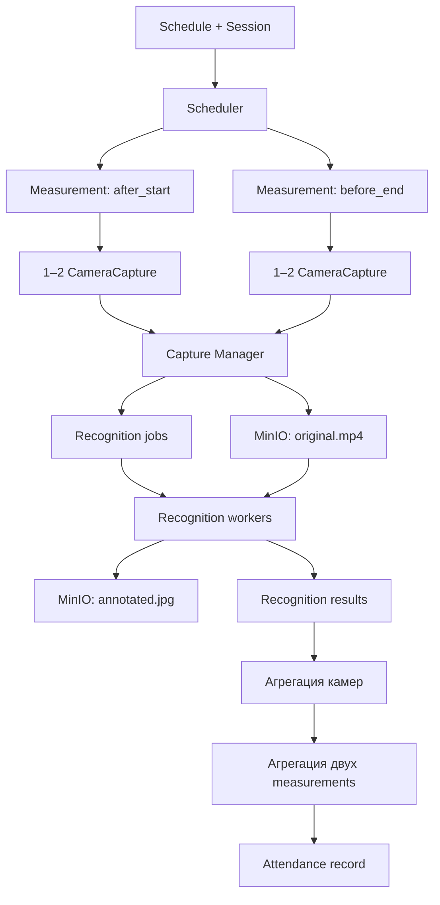

# Целевая модель данных системы посещаемости

## 1. Границы модели

Модель поддерживает следующий процесс:

1. расписание создаёт конкретное занятие `Session`;
2. для занятия создаются два замера `Measurement`;
3. первый замер выполняется через 15 минут после начала занятия;
4. второй замер выполняется за 15 минут до его окончания;
5. каждый замер использует одну или две камеры аудитории;
6. Capture Manager записывает по одному ролику с каждой камеры;
7. ролики сохраняются в MinIO;
8. recognition workers обрабатывают ролики из очереди;
9. для каждой камеры сохраняются числовой результат и один размеченный кадр;
10. результаты камер объединяются в результат замера;
11. два замера используются для формирования итоговой посещаемости занятия.

PostgreSQL хранит предметные данные, задания, состояния и ключи объектов.
MinIO хранит `original.mp4` и `annotated.jpg`.

## 2. ER-диаграмма



## 3. Справочники

### `groups`

Учебные группы.

| Поле | Тип | Ограничения |
|---|---|---|
| `id` | `bigint` | PK |
| `name` | `varchar(100)` | NOT NULL, UNIQUE |
| `students_count` | `integer` | NOT NULL, `>= 0` |

### `teachers`

Преподаватели. Сохраняется существующая модель проекта.

### `disciplines`

Дисциплины. Сохраняется существующая модель проекта.

### `classrooms`

Аудитории.

| Поле | Тип | Ограничения |
|---|---|---|
| `id` | `bigint` | PK |
| `number` | `varchar(50)` | NOT NULL |
| `capacity` | `integer` | `> 0` |
| `camera_aggregation_mode` | enum | NOT NULL |

`camera_aggregation_mode`:

```text
single        — в аудитории используется одна камера;
maximum       — камеры имеют пересекающиеся зоны, берётся максимум;
sum           — камеры смотрят на непересекающиеся зоны, результаты суммируются;
primary_backup — используется основная камера, резервная только при ошибке.
```

### `cameras`

Камеры следует вынести из `classrooms`. Поле `camera_url` в аудитории не
поддерживает две камеры и не хранит эксплуатационные настройки.

| Поле | Тип | Ограничения |
|---|---|---|
| `id` | `bigint` | PK |
| `name` | `varchar(100)` | NOT NULL, UNIQUE |
| `rtsp_url` | `varchar(1000)` | NOT NULL |
| `capture_group` | `varchar(100)` | NOT NULL, DEFAULT `default` |
| `enabled` | `boolean` | NOT NULL, DEFAULT `true` |
| `created_at` | `timestamptz` | NOT NULL |
| `updated_at` | `timestamptz` | NOT NULL |

`capture_group` определяет capture node или сетевую зону, имеющую доступ к
камере, например `building-a`.

RTSP URL может содержать секреты. В production предпочтительнее хранить отдельно
адрес камеры и ссылку на secret, а не пароль в открытом виде.

### `classroom_cameras`

Связь аудиторий и камер.

| Поле | Тип | Ограничения |
|---|---|---|
| `classroom_id` | `bigint` | PK, FK |
| `camera_id` | `bigint` | PK, FK |
| `role` | enum | NOT NULL |
| `priority` | `integer` | NOT NULL, DEFAULT `1` |
| `zone_code` | `varchar(50)` | NULL |

`role`:

```text
primary
secondary
backup
```

Ограничения предметной области:

- у аудитории должна быть хотя бы одна активная камера для автоматического
  замера;
- штатно поддерживается не более двух активных камер;
- для режима `primary_backup` должна существовать ровно одна `primary`;
- одна физическая камера не должна одновременно использоваться разными
  аудиториями.

## 4. Расписание и занятия

### `schedule`

Сохраняется существующая таблица расписания. Она определяет аудиторию, группу,
дисциплину, преподавателя и время занятия.

### `sessions`

Конкретное занятие на конкретную дату.

| Поле | Тип | Ограничения |
|---|---|---|
| `id` | `bigint` | PK |
| `schedule_id` | `bigint` | FK, NOT NULL |
| `date` | `date` | NOT NULL |
| `status` | enum | NOT NULL |
| `started_at` | `timestamptz` | NULL |
| `finished_at` | `timestamptz` | NULL |
| `created_at` | `timestamptz` | NOT NULL |

Уникальность:

```text
UNIQUE(schedule_id, date)
```

Рекомендуемые статусы:

```text
scheduled
in_progress
finished
cancelled
```

## 5. Замеры

### `measurements`

`Measurement` — один временной срез одного занятия.

| Поле | Тип | Ограничения |
|---|---|---|
| `id` | `bigint` | PK |
| `session_id` | `bigint` | FK, NOT NULL |
| `type` | enum | NOT NULL |
| `planned_at` | `timestamptz` | NOT NULL |
| `status` | enum | NOT NULL |
| `final_people_count` | `integer` | NULL, `>= 0` |
| `confidence` | `real` | NULL, от `0` до `1` |
| `aggregation_method` | enum | NOT NULL |
| `started_at` | `timestamptz` | NULL |
| `completed_at` | `timestamptz` | NULL |
| `created_at` | `timestamptz` | NOT NULL |
| `error` | `text` | NULL |

Типы:

```text
after_start — через 15 минут после начала;
before_end  — за 15 минут до окончания.
```

Уникальность:

```text
UNIQUE(session_id, type)
```

Это делает создание замеров идемпотентным: повторный проход scheduler не
создаст дубликат.

Статусы:

```text
scheduled
capturing
recognizing
completed
partially_completed
failed
cancelled
```

Время рассчитывается с учётом даты занятия и часового пояса приложения:

```text
after_start.planned_at = session date + schedule.starts_at + 15 минут
before_end.planned_at  = session date + schedule.ends_at - 15 минут
```

## 6. Получение видео

### `camera_captures`

Таблица одновременно представляет задание Capture Manager и результат записи.
Отдельная таблица `capture_jobs` не обязательна.

| Поле | Тип | Ограничения |
|---|---|---|
| `id` | `bigint` | PK |
| `measurement_id` | `bigint` | FK, NOT NULL |
| `camera_id` | `bigint` | FK, NOT NULL |
| `status` | enum | NOT NULL |
| `planned_at` | `timestamptz` | NOT NULL |
| `duration_seconds` | `smallint` | NOT NULL, DEFAULT `30` |
| `worker_id` | `varchar(100)` | NULL |
| `lease_until` | `timestamptz` | NULL |
| `attempts` | `smallint` | NOT NULL, DEFAULT `0` |
| `capture_started_at` | `timestamptz` | NULL |
| `capture_finished_at` | `timestamptz` | NULL |
| `original_bucket` | `varchar(100)` | NULL |
| `original_object_key` | `varchar(700)` | NULL |
| `content_type` | `varchar(100)` | NULL |
| `size_bytes` | `bigint` | NULL |
| `duration_ms` | `integer` | NULL |
| `error` | `text` | NULL |
| `created_at` | `timestamptz` | NOT NULL |
| `updated_at` | `timestamptz` | NOT NULL |

Уникальность:

```text
UNIQUE(measurement_id, camera_id)
```

Статусы:

```text
pending
claimed
recording
uploading
completed
retry_wait
failed
cancelled
```

Получение заданий одной capture-группы:

```sql
SELECT cc.id
FROM camera_captures cc
JOIN cameras c ON c.id = cc.camera_id
WHERE cc.status = 'pending'
  AND c.capture_group = :capture_group
  AND cc.planned_at <= now() + interval '10 seconds'
ORDER BY cc.planned_at, cc.id
FOR UPDATE SKIP LOCKED;
```

Capture Manager может получить весь близкий пакет заранее и локально дождаться
`planned_at`, чтобы запустить FFmpeg-процессы почти одновременно.

## 7. Очередь распознавания

### `recognition_jobs`

| Поле | Тип | Ограничения |
|---|---|---|
| `id` | `bigint` | PK |
| `camera_capture_id` | `bigint` | FK, NOT NULL, UNIQUE |
| `status` | enum | NOT NULL |
| `worker_id` | `varchar(100)` | NULL |
| `lease_until` | `timestamptz` | NULL |
| `heartbeat_at` | `timestamptz` | NULL |
| `attempts` | `smallint` | NOT NULL, DEFAULT `0` |
| `model_name` | `varchar(100)` | NOT NULL |
| `model_version` | `varchar(100)` | NOT NULL |
| `sample_rate_fps` | `real` | NOT NULL, DEFAULT `1` |
| `confidence_threshold` | `real` | NOT NULL |
| `started_at` | `timestamptz` | NULL |
| `finished_at` | `timestamptz` | NULL |
| `error` | `text` | NULL |
| `created_at` | `timestamptz` | NOT NULL |
| `updated_at` | `timestamptz` | NOT NULL |

Статусы:

```text
pending
processing
retry_wait
completed
failed
cancelled
```

Получение одного задания:

```sql
WITH selected AS (
    SELECT id
    FROM recognition_jobs
    WHERE status = 'pending'
    ORDER BY created_at, id
    FOR UPDATE SKIP LOCKED
    LIMIT 1
)
UPDATE recognition_jobs job
SET status = 'processing',
    worker_id = :worker_id,
    lease_until = now() + interval '30 minutes',
    heartbeat_at = now(),
    attempts = attempts + 1,
    started_at = COALESCE(started_at, now()),
    updated_at = now()
FROM selected
WHERE job.id = selected.id
RETURNING job.*;
```

Задание с истёкшим `lease_until` может быть возвращено в `pending`, если не
достигнут лимит попыток.

## 8. Результаты распознавания

### `recognition_results`

Один результат соответствует одному ролику одной камеры.

| Поле | Тип | Ограничения |
|---|---|---|
| `id` | `bigint` | PK |
| `recognition_job_id` | `bigint` | FK, NOT NULL, UNIQUE |
| `people_count` | `integer` | NOT NULL, `>= 0` |
| `detected_median` | `real` | NOT NULL |
| `detected_percentile_75` | `real` | NOT NULL |
| `detected_max` | `integer` | NOT NULL |
| `average_confidence` | `real` | NULL, от `0` до `1` |
| `sampled_frames` | `integer` | NOT NULL, `> 0` |
| `representative_frame_ms` | `integer` | NOT NULL |
| `annotated_bucket` | `varchar(100)` | NOT NULL |
| `annotated_object_key` | `varchar(700)` | NOT NULL |
| `media_expires_at` | `timestamptz` | NULL |
| `created_at` | `timestamptz` | NOT NULL |

MinIO:

```text
bucket: attendance-clips

original/sessions/{session_id}/measurements/{measurement_id}/cameras/{camera_id}.mp4
annotated/sessions/{session_id}/measurements/{measurement_id}/cameras/{camera_id}.jpg
```

Worker:

1. скачивает `original.mp4` напрямую из MinIO;
2. временно сохраняет его на локальный диск;
3. извлекает 1–2 кадра в секунду;
4. выполняет inference локальной моделью;
5. рассчитывает медиану, 75-й перцентиль и максимум;
6. выбирает репрезентативный кадр;
7. загружает `annotated.jpg` в MinIO;
8. сохраняет результат и object key;
9. удаляет временный файл.

## 9. Агрегация двух камер

Результаты камер объединяются на уровне `Measurement`.

### Одна камера

```text
measurement.final_people_count = camera.people_count
```

### Пересекающиеся зоны

```text
measurement.final_people_count = max(camera_results)
```

### Непересекающиеся зоны

```text
measurement.final_people_count = sum(camera_results)
```

### Основная и резервная камеры

Используется результат `primary`. Результат `backup` применяется, если:

- основная камера недоступна;
- распознавание основной камеры завершилось ошибкой;
- confidence основной камеры ниже установленного порога.

Автоматически определить пересечение обзоров только из количества людей нельзя.
Режим задаётся при конфигурации аудитории.

## 10. Итог занятия

### `attendance_records`

Одна агрегированная запись на занятие.

| Поле | Тип | Ограничения |
|---|---|---|
| `id` | `bigint` | PK |
| `session_id` | `bigint` | FK, NOT NULL, UNIQUE |
| `expected_count` | `integer` | NOT NULL |
| `after_start_count` | `integer` | NULL |
| `before_end_count` | `integer` | NULL |
| `detected_average` | `real` | NULL |
| `detected_max` | `integer` | NULL |
| `attendance_rate` | `real` | NULL |
| `calculation_status` | enum | NOT NULL |
| `calculated_at` | `timestamptz` | NULL |

Рекомендуется хранить оба замера отдельно, не оставляя только одно итоговое
число.

Начальная формула:

```text
detected_average = average(доступные measurement.final_people_count)
detected_max = max(доступные measurement.final_people_count)
attendance_rate = min(detected_average / expected_count, 1.0)
```

Статус:

```text
complete — доступны оба замера;
partial  — доступен один замер;
failed   — нет успешных замеров.
```

## 11. Индексы

Минимальный набор:

```sql
CREATE INDEX ix_measurements_due
    ON measurements (planned_at)
    WHERE status = 'scheduled';

CREATE INDEX ix_camera_captures_claim
    ON camera_captures (planned_at, id)
    WHERE status = 'pending';

CREATE INDEX ix_camera_captures_lease
    ON camera_captures (lease_until)
    WHERE status IN ('claimed', 'recording', 'uploading');

CREATE INDEX ix_recognition_jobs_claim
    ON recognition_jobs (created_at, id)
    WHERE status = 'pending';

CREATE INDEX ix_recognition_jobs_lease
    ON recognition_jobs (lease_until)
    WHERE status = 'processing';

CREATE INDEX ix_measurements_session
    ON measurements (session_id);
```

## 12. Идемпотентность

Для защиты от повторного выполнения:

```text
UNIQUE(session_id, measurement_type)
UNIQUE(measurement_id, camera_id)
UNIQUE(camera_capture_id) в recognition_jobs
UNIQUE(recognition_job_id) в recognition_results
UNIQUE(session_id) в attendance_records
```

Object key строится из стабильных идентификаторов. Повторная попытка записывает
тот же логический объект:

```text
original/.../cameras/12.mp4
annotated/.../cameras/12.jpg
```

Операции завершения jobs должны проверять текущий статус и `worker_id`.

## 13. Удаление медиа

MinIO lifecycle policy удаляет:

```text
original/*  — через 30 дней;
annotated/* — через 30–90 дней.
```

Строки `recognition_results` сохраняются. После `media_expires_at` backend не
пытается выдавать presigned URL и показывает, что медиа удалено по сроку
хранения.

## 14. Пользователи и права PostgreSQL

Рекомендуемые роли:

```text
attendance_backend
capture_worker
recognition_worker
```

`capture_worker`:

- читает назначенные камеры;
- изменяет `camera_captures`;
- создаёт `recognition_jobs`;
- не изменяет расписание и посещаемость.

`recognition_worker`:

- читает и изменяет `recognition_jobs`;
- читает связанные `camera_captures`;
- создаёт `recognition_results`;
- не изменяет расписание, занятия и справочники.

Миграции выполняются только ролью backend/deployment.

## 15. Изменения относительно текущей модели проекта

Существующая схема уже содержит:

- `groups`;
- `teachers`;
- `disciplines`;
- `classrooms`;
- `schedule`;
- `sessions`;
- `detection_snapshots`;
- `attendance_records`.

Необходимые изменения:

1. заменить одиночный `classrooms.camera_url` сущностями `cameras` и
   `classroom_cameras`;
2. добавить `measurements`;
3. добавить `camera_captures`;
4. добавить `recognition_jobs`;
5. добавить `recognition_results`;
6. расширить `attendance_records` двумя значениями замеров;
7. перенести object keys исходного видео и размеченного кадра в новые таблицы;
8. после перехода удалить либо переосмыслить `detection_snapshots`.

`detection_snapshots` можно оставить как необязательную таблицу покадровой
диагностики, но для основной работы достаточно агрегатов в
`recognition_results`. Полные bounding boxes при необходимости лучше сохранять
как JSON-объект в MinIO, а не раздувать транзакционные таблицы.

## 16. Целевой поток состояний



## 17. Аналитика и метрики веб-интерфейса

Справочники `groups`, `teachers` и `disciplines` являются обязательной частью
модели. Они связаны с `Session` через `Schedule`, поэтому каждый завершённый
`AttendanceRecord` можно однозначно отнести к группе, преподавателю и
дисциплине:

```text
AttendanceRecord
    → Session
        → Schedule
            ├── Group
            ├── Teacher
            ├── Discipline
            └── Classroom
```

### Метрики группы

- количество проведённых занятий;
- среднее число присутствующих;
- средняя доля посещаемости;
- число занятий с полным и частичным замером;
- динамика посещаемости по датам;
- статистика группы по дисциплинам.

### Метрики преподавателя

- количество проведённых занятий;
- средняя посещаемость занятий преподавателя;
- динамика по датам;
- сравнение дисциплин и учебных групп;
- доля занятий с неуспешными замерами.

### Метрики дисциплины

- средняя посещаемость дисциплины;
- динамика по датам;
- статистика по группам;
- статистика по преподавателям.

### Рекомендуемые индексы аналитики

```sql
CREATE INDEX ix_schedule_group
    ON schedule (group_id);

CREATE INDEX ix_schedule_teacher
    ON schedule (teacher_id);

CREATE INDEX ix_schedule_discipline
    ON schedule (discipline_id);

CREATE INDEX ix_sessions_schedule_date
    ON sessions (schedule_id, date);

CREATE INDEX ix_attendance_calculated
    ON attendance_records (calculated_at);
```

На первом этапе статистику можно вычислять SQL-запросами с агрегацией. При
увеличении объёма данных допускается добавить materialized views:

```text
group_attendance_daily
teacher_attendance_daily
discipline_attendance_daily
```

Они являются оптимизацией чтения, а не источником истины. Исходными данными
остаются `sessions`, `measurements`, `recognition_results` и
`attendance_records`.
